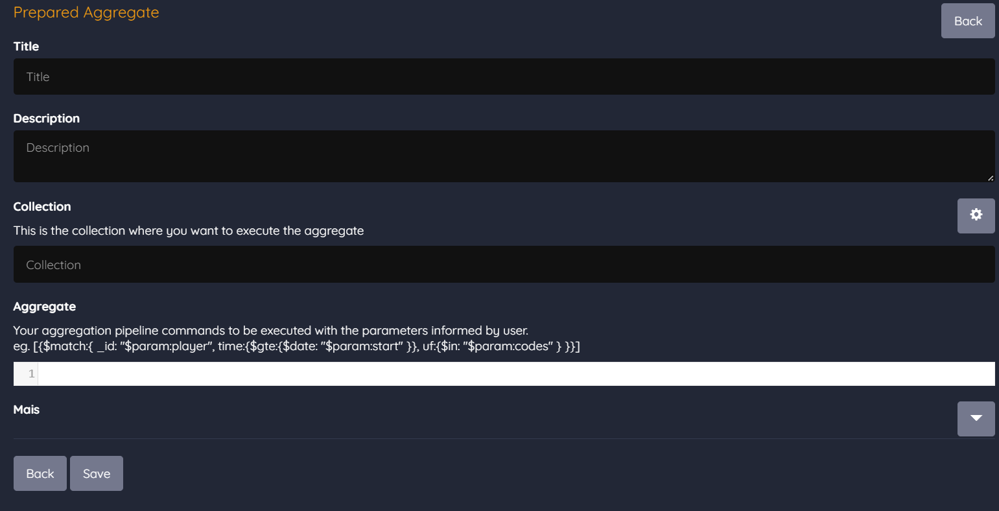

# Query Customizada

AGGREGATES: São comandos a serem executados no banco de dados da gamificação a fim de consultar e transformar os dados para serem apresentados na interface gráfica. Com estes comandos é possível retornar para o jogador as informações no formato exato que o desenvolvedor deseja apresentar. Estes comandos também são fundamentais na análise de dados e resultados de uma gamificação, constantemente sendo utilizados na construção de relatórios. O mongo é o banco de dados utilizado pela plataforma de gamificação, e a sintaxe destes comandos é a mesma utilizada por este banco.

\# Tutorial de Aggregates

[https://docs.google.com/document/d/e/2PACX-1vS2hXTSknqL6-zxOLGgtBwhiCscPBxuuTCPVEU0YFbDxxCb4rZKndaRbZ6E-qZQ0CpLpjnQkQn7YLre/pub](https://www.google.com/url?q=https://docs.google.com/document/d/e/2PACX-1vS2hXTSknqL6-zxOLGgtBwhiCscPBxuuTCPVEU0YFbDxxCb4rZKndaRbZ6E-qZQ0CpLpjnQkQn7YLre/pub&sa=D&source=editors&ust=1695686098398543&usg=AOvVaw1w5_mkSBudgIeZh-oPFmdy)

\# API Endpoint: /v3/database/{collection}/aggregate

\# JSON Payload: \[{"$match":{ "player": "john", "item": "xp" }}, {"$group":{ "_id":null, "total":{"$sum":"$total"} }}\]

FINDS: São comandos aggregate encapsulados do lado do servidor. Algumas vezes os comandos podem ficar muito grandes, ou simplesmente o desenvolvedor por questões de segurança não quer expor os comandos que estão sendo executados no banco de dados para retornar uma determinada informação para o jogador. Neste caso o Funifier permite a construção destes comandos no lado do servidor, e assim a chamada na interface gráfica do usuário fica simplificada ocultando do jogador o entendimento de como isso acontece nos bastidores.

\# STUDIO Path: /studio/prepared

\# API Endpoint: /v3/prepared/aggregate

\# JSON Payload: {"\_id": "total\_xp", "title": "Total XP", "description": "Total xp points the player has", "collection": "achievement", "aggregate": "\[\\n    {\\"$match\\":{ \\"player\\": \\"$param:player\\", \\"item\\": \\"xp\\" }},\\n    {\\"$group\\":{ \\"_id\\":null, \\"total\\":{\\"$sum\\":\\"$total\\"} }}\\n\]",

"script": "void prepare(aggregations, params) {}"}

\# MONGO Aggregate: \[{"$match":{ "player": "$param:player", "item": "xp" }}, {"$group":{ "_id":null, "total":{"$sum":"$total"} }}\]

Aggregates (Comandos de Agregação):

Os comandos de agregação são operações avançadas de consulta em bancos de dados, como o MongoDB, que permitem realizar transformações complexas nos dados. No contexto da gamificação que você mencionou, os comandos de agregação são usados para consultar e transformar os dados armazenados no banco de dados de forma a apresentar informações específicas de interesse para os desenvolvedores e jogadores.

Exemplo de comando de agregação em JSON:

json

Copy code

\[

    {"$match": { "player": "john", "item": "xp" }},

    {"$group": { "_id": null, "total": { "$sum": "$total" } }}

\]

Neste exemplo, o comando de agregação está filtrando os dados para encontrar informações sobre o jogador chamado "john" e o item "xp". Em seguida, ele está agrupando os resultados e calculando o total dos valores da propriedade "total".

Finds (Buscas):

Finds são comandos de agregação encapsulados do lado do servidor. Eles são usados quando os comandos de agregação podem se tornar muito complexos, longos ou quando os desenvolvedores desejam ocultar a complexidade dos comandos de consulta do banco de dados dos jogadores.

No seu contexto, os comandos de busca (finds) são construídos no lado do servidor (backend) e fornecem uma interface simplificada para que os jogadores obtenham informações específicas, sem a necessidade de entender os detalhes técnicos da consulta.

Exemplo de comando de busca em JSON:

json

Copy code

{

    "\_id": "total\_xp",

    "title": "Total XP",

    "description": "Total xp points the player has",

    "collection": "achievement",

    "aggregate": \[

        {"$match": { "player": "$param:player", "item": "xp" }},

        {"$group": { "_id": null, "total": { "$sum": "$total" } }}

    \],

    "script": "void prepare(aggregations, params) {}"

}

Neste exemplo, um comando de busca chamado "total_xp" é definido com metadados, incluindo título e descrição. Ele especifica a coleção de dados ("achievement") e os comandos de agregação necessários para calcular o total de pontos "xp" para um jogador específico. O script "prepare" pode ser usado para personalizar ainda mais a busca.

Em resumo, no contexto da gamificação, os comandos de agregação são usados para consultar e transformar dados complexos no banco de dados, enquanto os comandos de busca (finds) simplificam a chamada na interface do usuário, permitindo que os jogadores obtenham informações específicas de forma mais fácil e sem a necessidade de entender a complexidade técnica dos comandos de consulta. Isso contribui para uma experiência mais suave e amigável para o jogador.

Comandos de Agregação (Aggregates):

Os comandos de agregação desempenham um papel crucial na gamificação ao possibilitar a análise e a transformação de dados complexos armazenados em bancos de dados, como o MongoDB. Imagine que você está criando um jogo onde os jogadores acumulam pontos de experiência (XP). Para apresentar informações específicas, como o total de XP de um jogador, você pode usar comandos de agregação.

Por exemplo, um comando de agregação pode filtrar os dados para encontrar informações sobre um jogador específico, como "john", e o item "XP". Em seguida, ele agrupa os resultados e calcula o total dos valores da propriedade "total". Isso permite que você apresente ao jogador informações relevantes, como seu total de XP acumulado, de forma clara e concisa.

Comandos de Busca (Finds):

Os comandos de busca (finds) são uma extensão dos comandos de agregação, porém encapsulados do lado do servidor. Eles são uma solução eficaz quando os comandos de agregação se tornam muito complexos, longos ou quando você deseja ocultar a complexidade técnica dos comandos de consulta do banco de dados dos jogadores.

Imagine que você deseja que os jogadores consultem seu total de XP em um jogo sem se preocupar com a complexidade por trás disso. Nesse caso, você pode criar um comando de busca que define metadados, como título e descrição, e específica a coleção de dados a ser consultada, juntamente com os comandos de agregação necessários para calcular o total de pontos XP para um jogador específico. O jogador simplesmente faz a chamada, e o sistema cuida dos detalhes técnicos.

Em resumo, a gamificação é uma estratégia empolgante que utiliza comandos de agregação e busca para personalizar a experiência do jogador. Essas ferramentas permitem que você transforme dados complexos em informações envolventes e relevantes, mantendo os jogadores engajados e motivados. Além disso, a utilização de comandos de busca oculta a complexidade técnica, tornando a experiência do jogador mais simples e acessível, o que é essencial para o sucesso da gamificação em qualquer contexto. Portanto, ao criar sua próxima experiência gamificada, lembre-se do poder dos comandos de agregação e busca para criar uma experiência incrível para seus jogadores.
