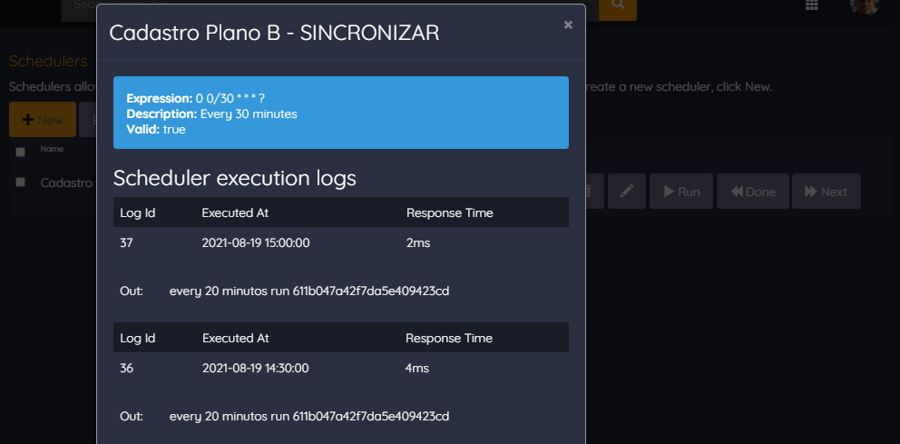

# Scheduler

FUNIFIER SCHEDULER -

Scheduler é uma funcionalidade avançada que permite ao administrador configurar tarefas para serem executadas em um horário específico e repetidas em uma frequência definida. Por exemplo, o administrador pode criar um Scheduler para gerar relatórios de engajamento semanalmente e enviar para os gerentes da empresa. Os Schedulers no Funifier utilizam a linguagem Java, permitindo aos desenvolvedores uma grande flexibilidade para definir a lógica exata da tarefa, incluindo a integração com o banco de dados do Funifier, envio de emails, fazer requisições HTTP, ler arquivos de um diretório FTP e assim por diante. Desta forma, é possível automatizar muitas tarefas que normalmente precisam ser realizadas manualmente, liberando tempo para se concentrar em outras áreas importantes.

Neste tutorial vamos aprender como utilizar os Schedulers Funifier. Esta funcionalidade permite agendar tarefas para serem executadas pelo servidor de tempos em tempos. Ao criar um scheduler você deverá informar:

* 1\. Se esta rotina está ativa;
* 2\. O nome da rotina;
* 3\. A expressão cron que define quando esta rotina deverá ser executada pelo servidor;
* 4\. O TimeZone (fuso horário) em que a expressão deverá ser avaliada;
* 5\. O script que será executado pelo servidor.

CRON EXPRESSION

No exemplo acima a expressão cron “0 0/30 * * * ?” está configurada para ser executada a cada 30 minutos. Por exemplo, é possível criar expressões rodar o scheduler de hora em hora, ou no primeiro dia do mês, ou toda segunda, quarta e sexta ao meio dia etc. Caso você precise de ajuda para criar uma expressão cron, clique no botão Help, para abrir o gerador de expressões cron: [https://www.freeformatter.com/cron-expression-generator-quartz.html](https://www.google.com/url?q=https://www.freeformatter.com/cron-expression-generator-quartz.html&sa=D&source=editors&ust=1695685505415683&usg=AOvVaw0DrbNbxjQvWcxRNhPHnXtf)

SCRIPT SCHEDULER

Segue abaixo um exemplo de script scheduler. O script recebe o objeto scheduler. E dentro do script é possível acessar o objeto manager, bem como usar o método println para escrever algo no log de execução do sheduler.

void execute(scheduler){

  println('every 30 minutos run ' + scheduler.id);

}

ADMINISTRAÇÃO DE SCHEDULERS

Na lista de administração de schedulers é possível forçar a execução de um scheduler utilizando o botão Run. É possível consultar o log das execuções anteriores no botão Done. E também verificar quando serão os próximos momentos em que o scheduler irá executar.

LOG DE EXECUÇÕES

Segue abaixo a representação do log das execuções de um scheduler. No log de execução é possível ver quando o scheduler foi executado, quanto tempo durou a execução do mesmo no servidor em milissegundos, e eventuais outputs ou erros detectados durante a execução.

PRÓXIMAS EXECUÇÕES

Segue abaixo a representação da lista das próximas execuções de um scheduler.

