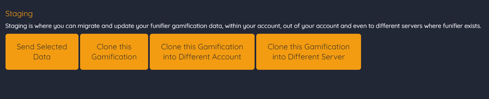
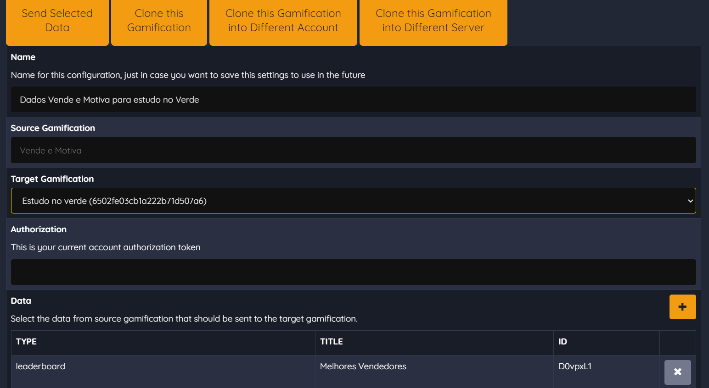
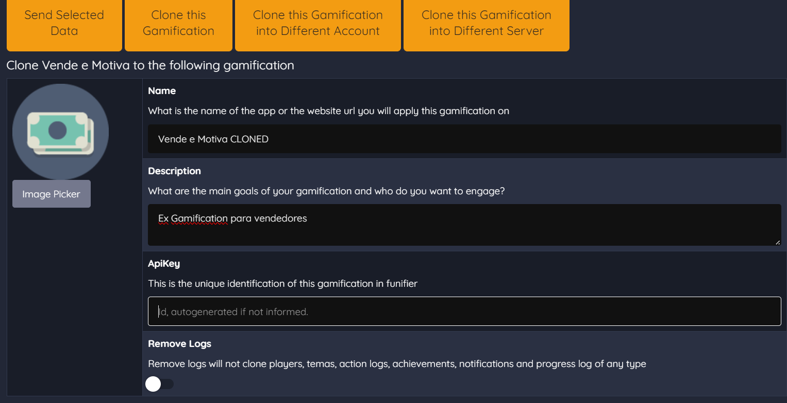
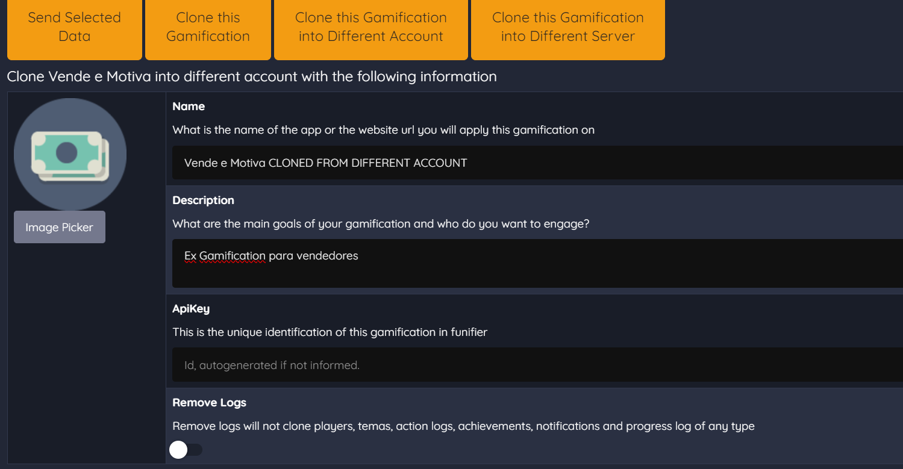
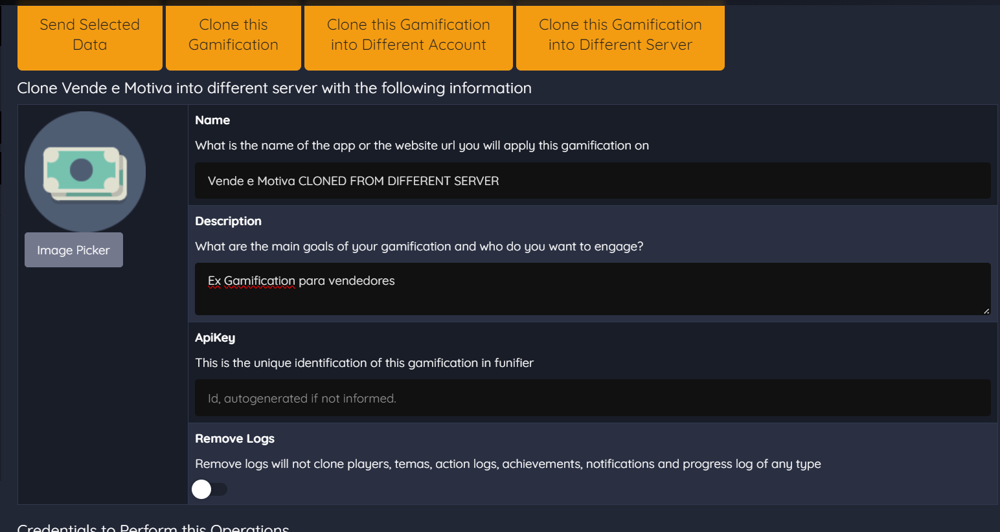

# Staging

STAGING: Em projetos reais é comum a criação de ambientes de homologação e de produção. O recurso de staging é utilizado para a gestão desses ambientes, permitindo clonar e migrar dados de um ambiente para outro. Possibilitando a criação de ambientes espelho. Sendo possível, por exemplo, criar um ambiente de produção em uma instância rodando nos Estados Unidos e um ambiente espelho de homologação rodando em uma instância na Europa. Este é um recurso muito importante para projetos de missão crítica operarem com segurança, enquanto são feitos os desenvolvimentos e testes a serem incluídas na gamificação.

\# STUDIO Path: /studio/integration/staging

No Funifier Studio, usando o recurso Staging, você pode:

* Enviar dados selecionados:

Nesse exemplo estou enviando um Leaderboard chamado ‘Melhores Vendedores’, da minha gamificação ‘Vende e Motiva’, para a minha outra gamificação ’Estudo no verde’

* Clonar uma Gamificação:

Nesse exemplo estou clonando a minha gamificação ‘Vende e Motiva’ na minha própria conta.

* Clonar uma Gamificação para uma conta diferente:

Nesse exemplo, estou criando um clone de minha gamificação ‘Vende e Motiva’ e irei enviar ele para uma outra conta.

* Clonar uma gamificação em um servidor diferente:

Nesse exemplo, estou a criar um clone da minha gamificação ‘Vende e Motiva’ e vou enviar para um outro servidor.

O que é Staging em Desenvolvimento de Software:

Ambiente de Homologação (Staging): É uma réplica do ambiente de produção, onde as novas atualizações de software são testadas antes de serem implantadas no ambiente de produção real. Este ambiente é chamado de "staging" ou "ambiente de homologação" e é usado para garantir que as mudanças no software não causem problemas graves quando forem lançadas para o público.

Clonagem e Migração de Dados: No ambiente de staging, é possível clonar dados do ambiente de produção ou importar dados de teste realistas para simular condições próximas ao ambiente de produção. Isso permite testar as funcionalidades do sistema em um ambiente controlado e realista.

Ambiente Espelho: O staging também é usado para criar ambientes espelho em diferentes localizações geográficas, como no exemplo que você mencionou, com uma instância de produção nos Estados Unidos e uma instância de homologação na Europa. Isso é importante para testar o desempenho do software em diferentes regiões e garantir que ele funcione corretamente para usuários em todo o mundo.

Testes de Missão Crítica: Para projetos de missão crítica, onde a disponibilidade contínua e o desempenho são essenciais, o staging é fundamental. Ele permite que as equipes de desenvolvimento e operações testem atualizações de software de maneira a minimizar o risco de interrupções no ambiente de produção.

Gamificação: No contexto de gamificação, o staging pode ser usado para testar e iterar sobre elementos de gamificação, como regras, pontuação, desafios e recompensas, antes de serem incorporados ao ambiente de produção do jogo. Isso ajuda a garantir que a experiência do usuário seja agradável e envolvente.

Benefícios do Staging:

Minimização de Riscos: Testar em um ambiente controlado reduz o risco de problemas graves no ambiente de produção.

Melhoria do Desempenho: Testar em ambientes espelho ajuda a otimizar o desempenho para diferentes regiões geográficas.

Maior Segurança: Garante que as atualizações não comprometam a segurança dos dados ou do sistema.

Validação de Funcionalidades: Permite validar novas funcionalidades antes de serem disponibilizadas para os usuários finais.

Iteração e Aperfeiçoamento: Facilita a iteração e melhoria contínua do software.

Em resumo, o uso de staging em projetos de desenvolvimento de software é uma prática recomendada para garantir que as atualizações e mudanças no sistema sejam testadas de forma abrangente e segura antes de serem lançadas para o público em produção. Isso contribui para a estabilidade e confiabilidade dos sistemas de missão crítica e é uma parte fundamental do ciclo de desenvolvimento de software.
