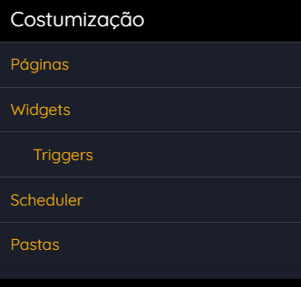
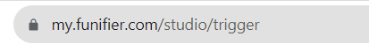
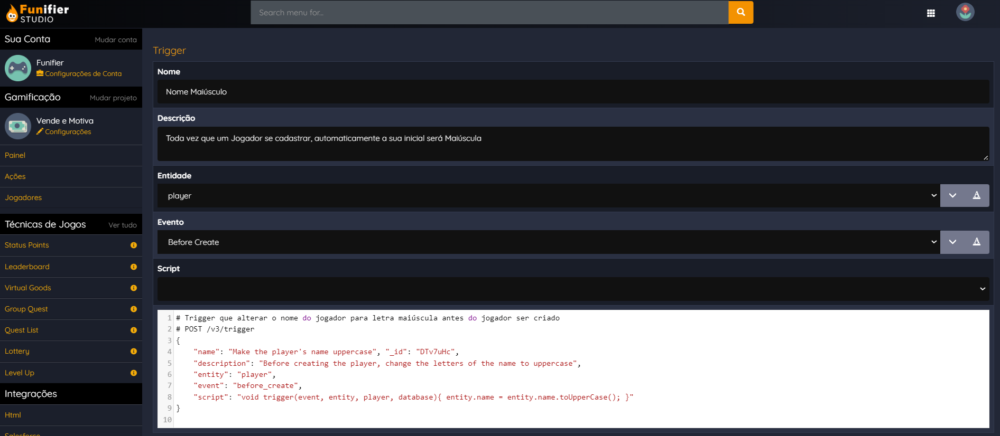
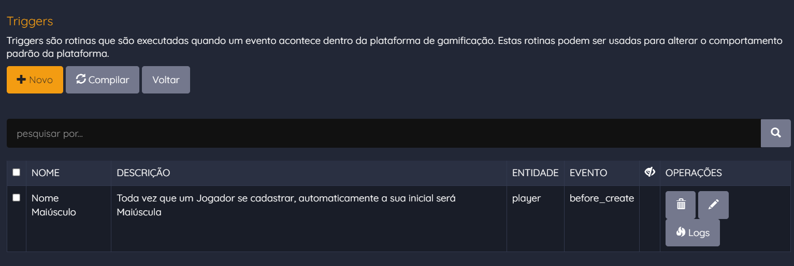
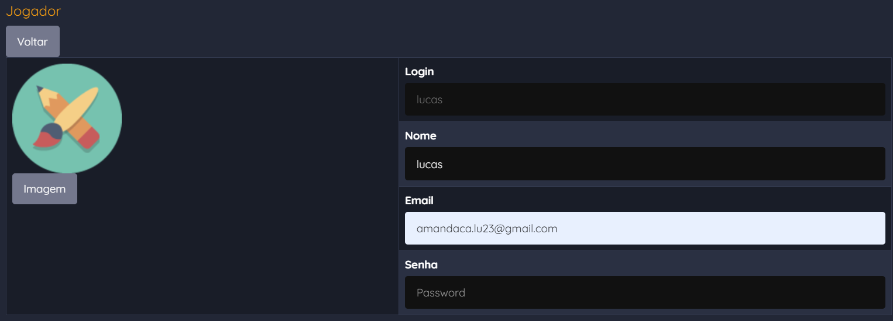
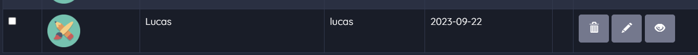

# Trigger

TRIGGERS

Triggers são códigos JAVA executados dentro do FUNIFIER ENGINE quando um evento específico acontecer dentro da gamificação. As triggers oferecem aos desenvolvedores uma grande flexibilidade para manipular informações em tempo real, permitindo mudar o comportamento padrão das técnicas de jogos e demais funcionalidades da plataforma. Por exemplo, a funcionalidade padrão de cadastro de um jogador na gamificação, não faz nada além de cadastrar os dados do jogador no banco de dados. Porém, com a Trigger, o desenvolvedor pode escrever um código JAVA para enviar um email de boas vindas para o jogador, logo após ele ser cadastrado no banco de dados. Triggers podem ser configuradas através do FUNIFIER STUDIO ou pela FUNIFIER API.

O caminho para configuração de triggers no STUDIO é: /studio/trigger

O endpoint para configuração de triggers na API REST é: /v3/trigger

CONFIGURAÇÃO DE UMA TRIGGER

A configuração de uma trigger é composta de três informações essenciais: o evento que indica quando a trigger deve ser executada, a entidade que informa que tipo de objeto está vinculado àquele evento, e o script Java a ser executado. Veja abaixo um exemplo de uma trigger que irá alterar o nome do jogador para letra maiúscula, antes de criar o jogador no banco de dados. Neste exemplo o evento é "before_create"e a entidade é "player".

\# Trigger que alterar o nome do jogador para letra maiúscula antes do jogador ser criado

\# POST /v3/trigger

{

    "name": "Make the player's name uppercase", "_id": "DTv7uHc",

    "description": "Before creating the player, change the letters of the name to uppercase",

    "entity": "player",

    "event": "before_create",

    "script": "void trigger(event, entity, player, database){ entity.name = entity.name.toUpperCase(); }"

}

Os campos utilizados nesta configuração básica de trigger são:

* "_id" : Identificador único da trigger; Caso não seja informado o Funifier define um valor;
* "name": Nome da trigger;
* "description": Descreve o que a trigger faz quando é executada pela engine;
* "entity": Qual entidade está sendo observada; Neste exemplo estamos observando a entidade player;
* "event": Evento que irá acionar a trigger quando ele ocorrer na entidade especificada; Neste exemplo estamos usando o evento "before_create", que acontece antes de criar o jogador no banco de dados.
* "script": Código JAVA que será executado quando a trigger for acionada. Todo script começa com a declaração do método void trigger(event, entity, player, database){};

EVENTOS E ENTIDADES

Eventos determinam quando uma trigger será executada. Por exemplo "before_create", é um evento que acontece antes de criar algo. Os eventos são expressões compostas de um prefixo e um sufixo. O prefixo indica o momento do evento (before ou after). O sufixo indica a operação (create, update, delete, win). Já as entidades indicam o que está sendo afetado pelo evento. Por exemplo, player, team, challenge. Veja abaixo alguns exemplos de combinação de eventos e entidades, e quando cada uma destas é acionada:

* "event": "before_create", "entity": "player"= Executado logo antes do novo jogador ser cadastrado no banco de dados; O objeto manipulado neste caso é um Player;
* "event": "after_create", "entity": "player"= Executado logo após o novo jogador ser cadastrado no banco de dados; O objeto manipulado neste caso é um Player;
* "event": "before_update", "entity": "player" = Executado quando um jogador existente estiver sendo modificado. Logo antes da alteração ser registrada no banco de dados;
* "event": "after_delete", "entity": "player"= Executado logo após um jogador ser removido da gamificação; O objeto manipulado neste caso é um Player;
* "event": "after_create", "entity": "challenge"= Executado logo após o administrador da gamificação criar um novo desafio; O objeto manipulado neste caso é um Challenge;
* "event": "after_win", "entity": "challenge"= Executado logo após um jogador conquistar um desafio; O objeto manipulado neste caso é um Achievement;.
* "event": "before_create", "entity": "action"= Executado logo antes do administrador da gamificação criar uma nova action; O objeto manipulado neste caso é um Action;
* "event": "before_win", "entity": "action"= Executado logo antes de um jogador realizar uma ação; O objeto manipulado neste caso é um ActionLog;
* "event": "after_win", "entity": "level"= Executado logo após um jogador subir de nível; O objeto manipulado neste caso é um Achievement;
* "event": "after\_win", "entity": "catalog\_item"= Executado logo após um jogador comprar um item da loja virtual; O objeto manipulado neste caso é um Achievement;
* "event": "after_win", "entity": "lottery"= Executado logo após um jogador ser sorteado na loteria; O objeto manipulado neste caso é um Achievement;
* "event": "after\_win", "entity": "mystery\_box"= Executado logo após um jogador ser ganhar um prêmio surpresa; O objeto manipulado neste caso é um Achievement;
* "event": "after_win", "entity": "competition"= Executado logo após um jogador vencer uma competição; O objeto manipulado neste caso é um Achievement;
* "event": "after\_create", "entity": "question\_log"= Executado logo após um jogador responder uma pergunta; O objeto manipulado neste caso é um QuestionLog;
* "event": "before_create", "entity": "achievement"= Executado logo antes de registrar uma recompensa gerada por um desafio; Por exemplo quando está sendo registrado os pontos gerados pelo desafio; O objeto manipulado neste caso é um Achievement;
* "event": "before\_create", "entity": "car\_\_c"= Executado logo antes do administrador da gamificação criar um objeto customizado car; O objeto neste caso é um HashMap com qualquer estrutura que o administrador esteja usando na collection car__c;

SCRIPT DA TRIGGER

Uma vez que a trigger foi acionada, a plataforma irá executar o método trigger que foi declarado dentro do script JAVA. Veja abaixo um exemplo do código JAVA de uma Trigger para colocar o campo nome do jogador em letras maiúsculas antes de criar o jogador no banco:

/\* "event": "before_create", "entity": "player" */

void trigger(event, entity, player, database) {

        entity.name = entity.name.toUpperCase();

}

Os parâmetros informados na assinatura do método trigger são:

* "event" : String com evento que foi acionado, Neste exemplo é "before_create";
* "entity": Objeto que está sendo manipulado; Neste exemplo é do tipo Player; Alguns tipos de objetos JAVA recebidos são Player, Challenge, Action, ActionLog, Achievement;
* "player" : String com o id do jogador que deu origem ao evento;
* "database" : Objeto utilitário para acessar o banco de dados da gamificação;

TIPOS DE OBJETOS

Um dos parâmetros do método trigger, é o entity. Este parâmetro é um objeto que pode ser de vários tipos diferentes. Alguns dos tipos de objetos que recebemos são Player, Challenge, Action, ActionLog, e Achievement. Mas existem vários outros tipos que você poderá manipular na sua trigger. Veja abaixo a estrutura dos principais objetos que serão recebidos no parâmetro entity dentro das triggers:

* Player : {"_id": "john", "name": "John Travolta", "email": "john@funifier.com", "image": {"small": { "url": "https://a.com/a.jpg"}, "medium": {"url": "https://a.com/a.jpg"}, "original": {"url": "https://a.com/a.jpg"}}, "teams": \["sales"\], "extra": {"country": "USA", "department": "IT"}, "created": {"$date": "2023-07-05T20:57:25.776Z"}, "updated": {"$date": "2023-07-05T20:57:25.777Z"}}
* Challenge : {"challenge": "Watch Video", "active": true, "id": "DTo8dS3", "description": "Complete this challenge by watching a video", "rules": \[{"actionId": "watch_video", "operator": 5, "total": 0}\],  "points": \[{"total": 10.0, "category": "xp", "operation": 0}\]}
* Action : {"id": "sell", "action": "Sell", "attributes": \[{"name": "product", "type": "String"}, {"name": "price", "type": "Number"}\], "active": true}
* ActionLog : {"id": "64a5d92", "actionId": "sell", "userId": "john", "time": {"$date": "2023-07-05T20:57:33.303Z"}, "attributes": {"product": "book", "price": 120}}
* Achievement : {"_id": "64a5d2", "player": "john", "total": 25.0, "type": 0, "item": "xp", "time": {"$date": "2023-07-05T20:57:33.303Z"}}

EXEMPLOS DE CÓDIGO JAVA DE TRIGGER

Podemos utilizar as triggers para por exemplo: Enviar email de boas vindas para o jogador quando ele entrar na gamificação; Publicar uma mensagem de parabenização em uma rede social quando o jogador ganhar uma medalha, etc. Perceba que este recurso deve ser usado com moderação, apenas nos casos onde as configurações padrão de técnicas de jogos do Funifier não forem suficientes para alcançar o resultado esperado pelo negócio. Por exemplo, na configuração de um desafio é possível definir que, ao completar um desafio o jogador ganha 10 pontos. Neste caso não é necessário a utilização de uma trigger para dar os 10 pontos. Porém, caso a pontuação não seja tão direta assim, envolvendo uma regra especial que não pode ser traduzida na configuração padrão do desafio usamos a trigger. Por exemplo, suponha que a pontuação para aquele desafio envolve uma fórmula onde consideramos quantos dias de empresa o jogador tem multiplicado pelo peso do departamento em que o jogador está lotado dentro da empresa. Então esta pontuação será diferente de jogador para jogador, mesmo que eles estejam completando o mesmo desafio. Este sim é um exemplo de situação onde a trigger é necessária.

EXEMPLO 1: TRIGGER PARA DUPLICAR PONTOS DE JOGADORES DA ÁREA DE TI

Neste exemplo, vamos criar uma trigger para dobrar a quantidade de pontos ganhos pelos jogadores do departamento de TI quando eles completarem um desafio. Neste código o parâmetro entity é um objeto do tipo Achievement. Este objeto tem um campo type que indica o tipo de conquista. Neste código vamos: Verificar se o achievement é do tipo ponto; Usar o manager para consultar quem é o jogador que está recebendo este ponto; Ver se no campo extra do jogador existe o departamento de TI; E multiplicar o total de pontos por 2. Veja abaixo o código JAVA da trigger:

/\* "event": "before_create", "entity": "achievement" */

void trigger(event, entity, player, database) {

    if(entity.type == Achievement.TYPE_POINT) {

      Player currentPlayer = manager.getPlayerManager().findById(player);

      if("IT".equals(currentPlayer.extra.department)) { entity.total = entity.total * 2; }

    }

}

EXEMPLO 2: TRIGGER PARA DAR PONTO PARA TODOS OS AMIGOS DO JOGADOR

Neste exemplo, vamos criar uma trigger para dar 1 ponto para todos os amigos de um jogador, quando este jogador ganhar 100 pontos ou mais em um desafio. Neste código o parâmetro entity é um objeto do tipo Achievement. Este objeto tem um campo type que indica o tipo de conquista. Neste código vamos: Verificar se o achievement é do tipo ponto e se o total de pontos é maior ou igual a 100; Usar o manager para consultar quem é o jogador; Registrar um um Achievement de 1 ponto para cada amigo do jogador; Veja abaixo o código JAVA da trigger:

/\* "event": "before_create", "entity": "achievement" */

void trigger(event, entity, player, database){

    if(entity.type == Achievement.TYPE_POINT && entity.total >= 100) {

      Player p = manager.getPlayerManager().findById(player);

      for(String friend : p.friends) {

        Achievement a = new Achievement();

        a.player = friend;

        a.total = 1;

        a.type = 0;

        a.item = entity.item;

        a.time = new Date();

        a.id = Guid.newShortGuid();

        manager.getAchievementManager().addAchievement(a);

      }

    }

}

EXEMPLO 3: TRIGGER PARA ENVIAR EMAIL DE BOAS VINDAS PARA JOGADOR

Neste exemplo, vamos criar uma trigger para enviar um email de boas vindas ao jogador assim que ele for criado no banco de dados. Neste código o parâmetro entity é um objeto do tipo Player. Este objeto tem os campos name e email que vamos usar no envio do email. Neste código vamos: Consultar quantos jogadores já estão cadastrados na gamificação; Montar e enviar o email usando a biblioteca (org.simplejavamail) que está disponível no contexto da trigger; Veja abaixo o código JAVA da trigger:

/\* "event": "after_create", "entity": "player" */

void trigger(event, entity, player, database){

    long total = manager.getPlayerManager().findTotal();

    Email email = EmailBuilder

    .startingBlank()

    .from("Company", "your@company.com")

    .to(entity.getName(), entity.email)

    .withSubject("Welcome!")

    .withPlainText("Welcome " + entity.name + ", you are the member number " + total)

    .buildEmail();

    MailerBuilder.withSMTPServer("host", 587, "login", "password")

    .buildMailer()

    .sendMail(email);

}

EXEMPLO 4: TRIGGER PARA FAZER REQUISIÇÕES HTTP USANDO UNIREST

Neste exemplo, vamos criar uma trigger para enviar os dados da compra feita pelo jogador para o Zapier. Para isso vamos precisar fazer uma requisição HTTP na api do Zapier. Neste código o parâmetro entity é um objeto do tipo Achievement. Este objeto tem o login do jogador e ID do item que foi comprado; Neste código vamos: Consultar os dados completos do jogador que fez a compra; Consultar os dados completos do item que foi comprado; Colocar estas duas informações em um novo objeto; Transformar este objeto em JSON; e enviar o JSON no corpo da requisição. A requisição HTTP será feita usando a biblioteca (com.mashape.unirest) que está disponível no contexto da trigger; Veja abaixo o código JAVA da trigger:

/\* "event": "after\_win", "entity": "catalog\_item" */

void trigger(event, entity, player, database){

    Player buyer = manager.getPlayerManager().findById(entity.player);

    CatalogItem item = manager.getCatalogManager().findItemById(entity.item);

    HashMap zap = new HashMap();

    zap.put("purchase", entity);

    zap.put("buyer", buyer);

    zap.put("item", item);

    HttpResponse&lt;String&gt; response = Unirest.post("ZAPIER_WEBHOOK_URL")

    .header("Content-Type", "application/json")

    .body(JsonUtil.toJson(zap))

    .asString();

}

EXEMPLO 5: TRIGGER PARA CRIAR CÓDIGO PARA CONVIDAR AMIGOS

Neste exemplo, vamos criar uma trigger para criar um código e inserir no perfil do jogador antes do jogador ser criado; O jogador poderá compartilhar este código posteriormente com seus amigos; Neste código o parâmetro entity é um objeto do tipo Player. Este objeto tem um campo extra onde podemos incluir informações adicionais como este código para convidar amigos. Veja abaixo o código JAVA da trigger:

/\* "event": "before_create", "entity": "player" */

void trigger(event, entity, player, database){

    String code = Guid.shortTimeMillis();

    entity.extra.put("code", code);

}

EXEMPLO 6: TRIGGER PARA CONSULTAR OBJETOS NO BANCO DE DADOS

Neste exemplo, vamos criar uma trigger para pesquisar no banco de dados o preço de um produto que o jogador está vendendo e incluir no log de ação que está sendo criado; Usaremos a biblioteca do MongoDB para consultar o objeto customizado. Neste código o parâmetro entity é um objeto do tipo ActionLog. Vamos incluir o preço nos atributos da venda. Veja abaixo o código JAVA da trigger:

/\* "before_win", "entity": "action" */

void trigger(event, entity, player, database){

    String id = entity.attributes.product;

    Object product = database.getCollection("product\_\_c").findOne('{\_id:#}', id).as(Object.class);

    entity.attributes.put("price", product.price);

}

EXEMPLO 7: TRIGGER PARA EXECUTAR COMANDOS AGGREGATE NO DB

Neste exemplo, vamos criar uma trigger para descobrir o total de pontos do jogador com mais pontos na gamificação. E vamos incluir esta informação nos atributos do log de ação que está sendo criado. Para isso vamos executar um comando aggregate usando a biblioteca (org.jongo) que está disponível no contexto da trigger. Neste código o parâmetro entity é um objeto do tipo ActionLog. Veja abaixo o código JAVA da trigger:

/\* "before_win", "entity": "action" */

void trigger(event, entity, player, database){

    org.jongo.MongoCollection collection = database.getCollection("achievement");

    List&lt;Object&gt; highest = Arrays.asList(

    collection.aggregate('{"$match": {"type": 0, "item": "xp"}}')

    .and('{"$group": {"_id": "$player", "total": {"$sum": "$total"}}}')

    .and('{"$sort": {"total": -1}}')

    .and('{"$limit":1}')

    .as(Object.class));

    if(highest != null && highest.size() > 0) {

        Object highestPointsPlayer = highest.get(0);

        entity.attributes.put("highest", highestPointsPlayer.total);

    }

}

MANAGERS

Dentro de uma trigger é possível acessar o objeto "manager". Este objeto dá acesso aos diversos managers disponíveis dentro da FUNIFIER ENGINE. Estes managers permitem acessar poderosas funcionalidades dentro da plataforma. Já utilizamos alguns managers até agora, como por exemplo: PlayerManagerpara localizar um jogador pelo seu id; CatalogManager para localizar um item em um catálogo; Veja abaixo alguns exemplos de managers disponíveis dentro da FUNIFIER ENGINE e suas principais operações:

PlayerManager: Forma de acesso manager.getPlayerManager(); Permite gerenciar jogadores; Principais métodos:

* Player findById(String id);
* void insert(Player player);
* void delete(String id);

ActionManager: Forma de acesso manager.getActionManager(); Permite gerenciar ações e registrar action logs; Principais métodos:

* Action findActionById(String id);
* void addAction(Action action);
* void deleteAction(String id);
* void track(ActionLog log);
* List&lt;Achievement&gt; trackSynchonous(ActionLog log);

CatalogManager: Forma de acesso manager.getCatalogManager(); Permite gerenciar e comprar itens de um catálogo; Principais métodos:

* Catalog findById(String id);
* void add(Catalog catalog);
* void delete(String id);
* CatalogItem findItemById(String id);
* void addItem(CatalogItem item);
* void deleteItem(String id);
* Map&lt;String, Object&gt; purchase(Achievement purchase, boolean async);
* void undoPurchase(String id);

LotteryManager: Forma de acesso manager.getLotteryManager(); Permite gerenciar, rodar, e criar tickets para participar de sorteios; Principais métodos:

* Lottery find(String id);
* void insert(Lottery lottery);
* void delete(String id);
* void insertTicket(LotteryTicket ticket);
* Iterable&lt;LotteryTicket&gt; execute(String id);
* void undoExecute(String id);

