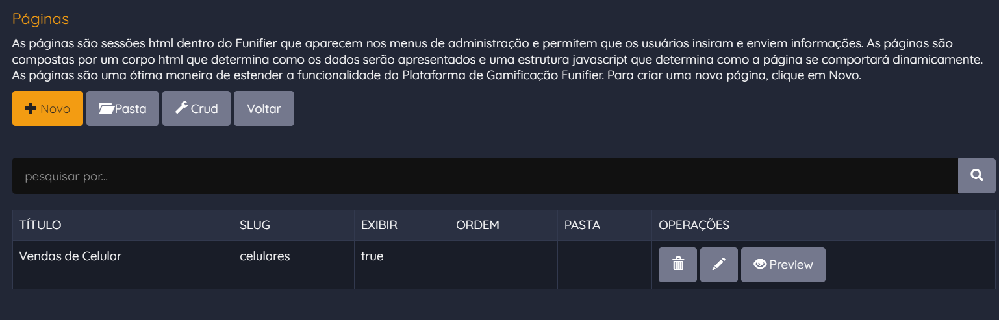
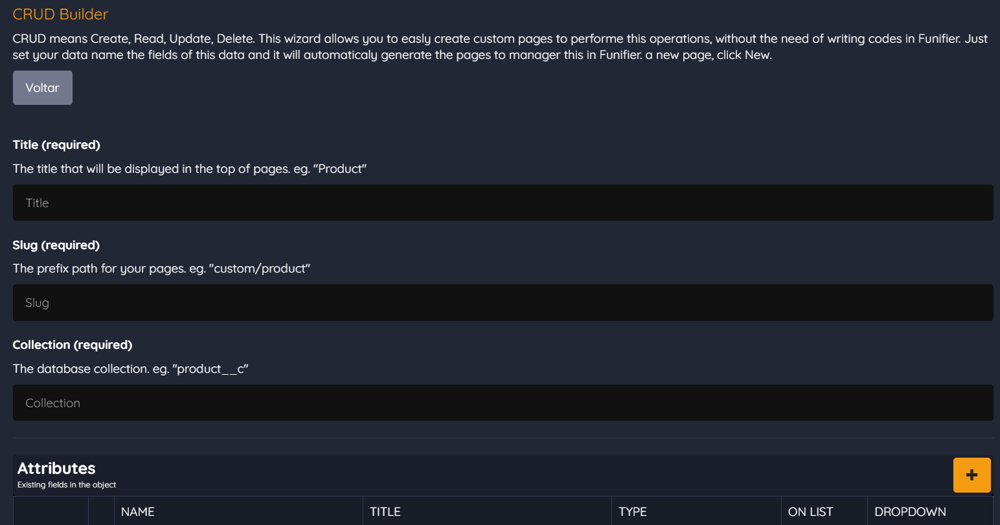
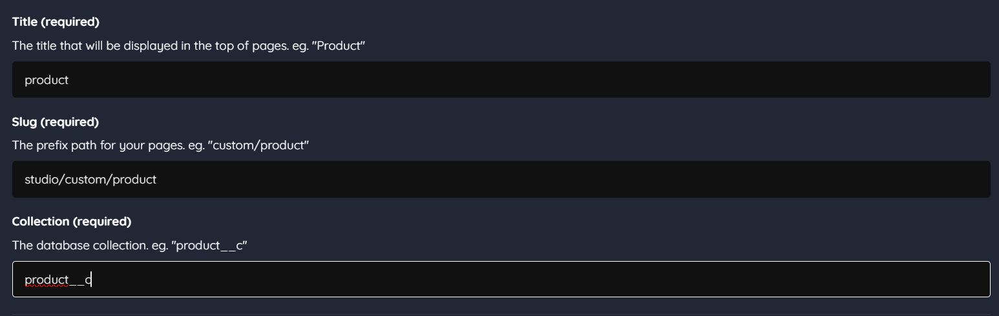
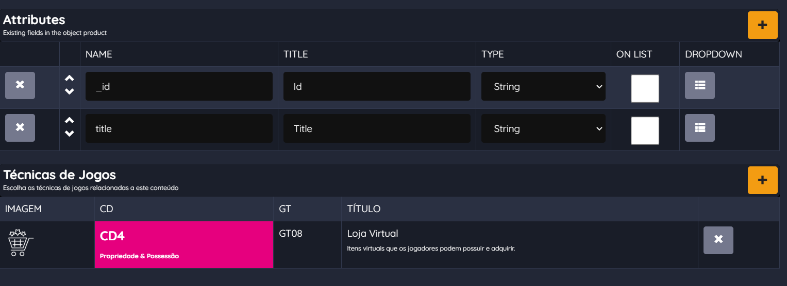

# CRUD

CRUD (Create, Read, Update, Delete)

Create (Criar):

\- Ação: Permitir que um administrador do sistema crie uma nova página customizada.

\- Interface do Usuário: Uma interface de administração com campos para inserir informações da página, como título, slug, código HTML, código JavaScript, e outras configurações relevantes.

\- Processamento: Os dados inseridos na interface são validados e armazenados no banco de dados do sistema de gamificação.

Read (Ler):

\- Ação: Permitir que um administrador do sistema visualize as páginas customizadas existentes.

\- Interface do Usuário: Uma lista de páginas customizadas com opções para visualizar os detalhes de cada página.

\- Processamento: As informações das páginas customizadas são recuperadas do banco de dados e exibidas na interface.

Update (Atualizar):

\- Ação: Permitir que um administrador do sistema atualize uma página customizada existente.

\- Interface do Usuário: Uma interface de edição que permite ao administrador modificar as informações da página, como título, código HTML, código JavaScript, etc.

\- Processamento: As alterações feitas na interface de edição são validadas e atualizadas no banco de dados.

Delete (Excluir):

\- Ação: Permitir que um administrador do sistema exclua uma página customizada existente.

\- Interface do Usuário: Uma opção de exclusão na página de detalhes da página customizada.

\- Processamento: A página customizada selecionada é removida do banco de dados.

Aqui está um exemplo simplificado de como essas operações podem ser implementadas:

Create (Criar):

\- Interface do Usuário: Um formulário com campos para inserir informações da nova página customizada, como título, slug, código HTML, código JavaScript, etc.

\- Processamento: Quando o administrador preenche o formulário e envia os dados, eles são validados e armazenados no banco de dados. Um novo registro é criado na tabela de páginas customizadas com as informações fornecidas.

Read (Ler):

\- Interface do Usuário: Uma lista de páginas customizadas com títulos e opções para visualizar detalhes.

\- Processamento: Quando o administrador acessa a lista de páginas customizadas, o sistema recupera os registros do banco de dados e os exibe na lista. Ao clicar em uma página, os detalhes da página são carregados e exibidos.

Update (Atualizar):

\- Interface do Usuário: Uma página de edição com campos preenchidos com as informações atuais da página customizada. O administrador pode fazer alterações e salvar.

\- Processamento: Quando o administrador faz alterações na página e clica em "Salvar", as informações são validadas e atualizadas no banco de dados. O registro correspondente é modificado com as novas informações.

Delete (Excluir):

\- Interface do Usuário: Uma opção de exclusão na página de detalhes da página customizada.

\- Processamento: Quando o administrador escolhe excluir uma página, o sistema remove o registro correspondente do banco de dados.

