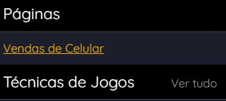
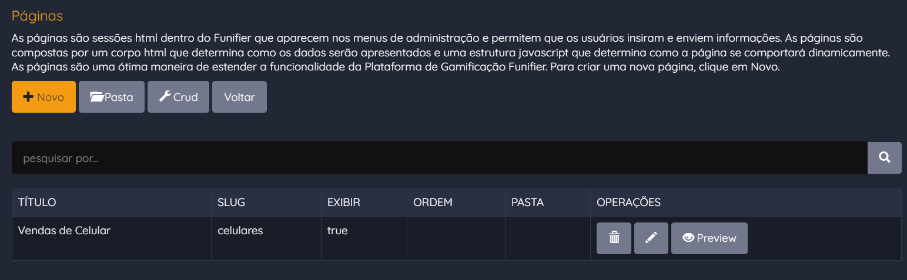

# Introdução

CUSTOM PAGES

Páginas customizadas são apresentadas dentro do FUNIFIER STUDIO. Esta funcionalidade permite criar dentro do FUNIFIER STUDIO páginas para atender necessidades específicas dos administradores de uma gamificação. Por exemplo: Em uma gamificação de uma equipe de vendas de veículos, o gestor pode ter a necessidade de gerenciar os veículos que a equipe vende. Neste caso poderíamos criar uma página de administração de veículos; Este gestor pode ainda ter a necessidade de acompanhar os resultados da equipe, neste caso poderíamos criar uma página com indicadores de performance da equipe, mostrando o total de vendas, gráficos em pizza mostrando o percentual de vendas por veículo, a quantidade de vendas por vendedor, etc; Páginas Customizadas podem ser configuradas através do FUNIFIER STUDIO ou pela FUNIFIER API.

O caminho para configurar páginas customizadas no STUDIO é: /studio/page

O endpoint para configurar páginas customizadas na API REST é: /v3/database/studio_page

CONFIGURAÇÃO

A configuração de uma Página Customizada dentro do FUNIFIER STUDIO é composta de três informações essenciais: um código HTML, JAVASCRIPT e uma URL. Internamente o FUNIFIER STUDIO utiliza a biblioteca javascript "AngularJs"e o css "Bootstrap". Quando você estiver escrevendo seu código JAVASCRIPT use o AngularJs e quando escrever seu código HTML use o Bootstrap. Dentro do contexto Javascript, você também tem acesso a um objeto chamado "Marketplace", que possui alguns métodos utilitários para acessar a URL da API, recuperar um token de acesso a API, além de outras funções. Veja abaixo um exemplo de como criar uma página customizada no FUNIFIER STUDIO utilizando estes recursos.

\# Página com botão Hello, que exibe uma mensagem de alerta quando clicado

\# PUT /v3/database/studio_page

{

    "_id": "64a25a",

    "display": true,

    "title": "Hello World!",

    "slug": "studio/custom/hello",

    "html": "&lt;button ng-click=\\"hello()\\" class=\\"btn btn-warning\\"&gt;Hello&lt;/button&gt;",

    "script": "$scope.hello = function(){ alert('Hello World!'); }"

}

Os campos utilizados nesta configuração básica de página customizada são:

* "_id" : Identificador único; Caso não seja informado o Funifier define um valor;
* "display": Indica se a página deve ser apresentada no menu do STUDIO ou não;
* "title": Nome da página customizada; Este é o nome que irá aparecer no menu;
* "slug": Este é o caminho relativo da página no studio;
* "html": Código HTML da página; Este código usa css Bootstrap;
* "script": Código JAVASCRIPT da página; Este código roda AngularJs;

EXEMPLO 1: CUSTOM PAGE DE LISTA DE DESAFIOS

Neste exemplo, vamos criar uma página customizada para exibir a lista de desafios configurados na gamificação. Esta é apresentada no menu com o nome Quest List. Nesta página temos um JAVASCRIPT que faz uma requisição http no endpoint /v3/database/challenge para retornar os desafios cadastrados e atribuir a variável $scope.all no contexto do AngularJs. Veja abaixo o código JAVASCRIPT da página customizada:

/\* "display": true, "title": "Quest List", "slug": "studio/custom/challenge" */

$scope.all = \[\];

$scope.list = function () {

  $http({method: 'GET', url:Marketplace.auth.getService() + '/v3/database/challenge',

         headers: {"Authorization": Marketplace.auth.getAuthorization(), "content-type": "application/json"}

        }).then(function(data){

    $scope.all = data.data;

  }, function(err){

    console.log(err);

  });

};

$scope.list();

Veja abaixo o código HTML da página customizada:

&lt;!\-\- "display": true, "title": "Quest List", "slug": "studio/custom/challenge" --&gt;

&lt;div class="title-block"&gt;

  &lt;h4&gt;Quest List&lt;/h4&gt;

&lt;/div&gt;

&lt;table class="table table-striped table-bordered"&gt;

  &lt;thead&gt;

    &lt;tr&gt;&lt;td&gt;CHALLENGE&lt;/td&gt;&lt;/tr&gt;

  &lt;/thead&gt;

  &lt;tr ng-repeat="(index, obj) in all"&gt;

    &lt;td&gt;{{obj.challenge}}&lt;/td&gt;

  &lt;/tr&gt;

&lt;/table&gt;

Veja as funções do objeto Marketplace que estão sendo usadas no código javascript:

* "Marketplace.auth.getService()" : Retorna a URL da FUNIFIER API que está sendo usada pelo FUNFIER STUDIO. Ex: https://service2.funifier.com
* "Marketplace.auth.getAuthorization()" : Retorna o token de acesso do usuário que está logado no FUNIFIER STUDIO, este token é usado para fazer as requisições http na FUNIFIER API;

EXEMPLO 2: CUSTOM PAGE DE LISTA PAGINADA DE JOGADORES

Neste exemplo, vamos criar uma página customizada para exibir uma lista paginada de jogadores. Por padrão a API retorna apenas os 100 primeiros registros de uma consulta. Mas, neste exemplo, vamos ver como navegar por todos os registros de jogadores cadastrados no banco de dados. Esta é apresentada no menu com o nome Player List. Nesta página temos um JAVASCRIPT que faz uma requisição http no endpoint /v3/database/player para retornar os jogadores cadastrados e atribuir a variável $scope.all no contexto do AngularJs. No cabeçalho da requisição é informado o campo "Range", que informa para a API a partir de qual registro deve começar a leitura e quantos registros devem ser retornados. Veja abaixo o código JAVASCRIPT da página customizada:

/\* "display": true, "title": "Player List", "slug": "studio/custom/player" */

$scope.range = { request: "items=0-100" };

$scope.gotopage = function(page){

  $scope.range.request = Marketplace.range.paginate(page, $scope.range.response);

  $scope.list();

};

$scope.paginate = function (total) {

  var to = $scope.range.page + total;

  $scope.range.request = Marketplace.range.paginate(to, $scope.range.response);

  $scope.list();

};

$scope.all = \[\];

$scope.list = function () {

  $http({method: 'GET', url:Marketplace.auth.getService() + '/v3/database/player',

    headers: {"Authorization": Marketplace.auth.getAuthorization(), "Range": $scope.range.request, "content-type": "application/json"}

  }).then(function(data){

    $scope.all = data.data;

    $scope.range = Marketplace.range.parse(data.headers(\["content-range"\]));

  }, function(err){

    console.log(err);

  });

};

$scope.list();

Veja abaixo o código HTML da página customizada:

&lt;!\-\- "display": true, "title": "Player List", "slug": "studio/custom/player" --&gt;

&lt;div class="title-block"&gt;

  &lt;h4&gt;Players ({{range.count}})&lt;/h4&gt;

  &lt;p class="help-block"&gt;Paginated list of all players in this gamification.&lt;/p&gt;

&lt;/div&gt;

&lt;table class="table table-striped table-bordered"&gt;

  &lt;thead&gt;

    &lt;tr&gt;

      &lt;td&gt;LOGIN&lt;/td&gt;

      &lt;td&gt;NAME&lt;/td&gt;

    &lt;/tr&gt;

  &lt;/thead&gt;

  &lt;tr ng-repeat="(index, obj) in all"&gt;

    &lt;td&gt;{{obj._id}}&lt;/td&gt;

    &lt;td&gt;{{obj.name}}&lt;/td&gt;

  &lt;/tr&gt;

&lt;/table&gt;

&lt;!\-\- pagination --&gt;

&lt;div&gt;

  Page

  &lt;input type="number" ng-model="range.page" ng-change="gotopage(range.page)" style="width:40px;" /&gt; of {{range.pages}}

  &lt;button ng-click="paginate(-1)" class="btn btn-default"&gt;

    &lt;span class="glyphicon glyphicon-chevron-left" aria-hidden="true"&gt;&lt;/span&gt;

  &lt;/button&gt;

  &lt;button ng-click="paginate(+1)" class="btn btn-default"&gt;

    &lt;span class="glyphicon glyphicon-chevron-right" aria-hidden="true"&gt;&lt;/span&gt;

  &lt;/button&gt;

&lt;/div&gt;

&lt;!\-\- pagination --&gt;

Veja as funções do objeto Marketplace que estão sendo usadas no código javascript:

* "Marketplace.range.parse(content_rage)": Analisa o campo content-range do cabeçalho da resposta da API (response.header.content-range) para obter todos os elementos da página de resultados atual. Um exemplo de parâmetro content_range informado no método é "items 0-10/8844"; O método parse, retorna um objeto com a página atual, total de páginas, total de documentos etc.
* "Marketplace.range.paginate(page, content_range)": Constrói o valor que deverá ser informado no campo Range (request.header.range) do cabeçalho de uma requisição à API para acessar a página desejada. O resultado deve ser enviado em sua requisição na FUNIFIER API; Um exemplo de Range gerado pelo método paginate é "items=0-100";

EXEMPLO 3: CUSTOM PAGE DE GERENCIAMENTO DE CARRO (CRUD)

Neste exemplo, vamos criar um CRUD de carros. CRUD significa (Create, Read, Update, Delete). Em outras palavras, vamos criar uma administração de carros onde será possível listar todos os carros, criar, alterar e excluir carros do banco de dados. Neste exemplo vamos criar 2 páginas: A página "Car List"para listar e excluir os carros existentes; E a página "Car Form"para criar ou alterar um carro. A página "Car Form"não estará visível no menu. Ela será acessada a partir da página "Car List".

Veja abaixo o código JAVASCRIPT da página "Car List":

/\* "display": true, "title": "Car List", "slug": "studio/custom/car/list" */

$scope.range = { request: "items=0-100" };

$scope.gotopage = function(page){

  $scope.range.request = Marketplace.range.paginate(page, $scope.range.response);

  $scope.list();

};

$scope.paginate = function (total) {

  var to = $scope.range.page + total;

  $scope.range.request = Marketplace.range.paginate(to, $scope.range.response);

  $scope.list();

};

$scope.create = function () { $location.path("/studio/custom/car/form/new"); };

$scope.edit = function (id) { $location.path("/studio/custom/car/form/" + id); };

$scope.remove = function (index, id) {

  if (confirm("Do you realy want to delete this Car?")) {

    $http({

        method: 'DELETE', url: Marketplace.auth.getService() + "/v3/database/car\_\_c?q=\_id:'" + id + "'",

        headers: { "Authorization": Marketplace.auth.getAuthorization(), "content-type": "application/json", "cache-control": "no-cache" }

    }).then(function (data) {

      $scope.list();

    }, function (err) {

      console.log(err);

    });

  }

};

$scope.all = \[\];

$scope.list = function () {

  $http({method: 'GET', url:Marketplace.auth.getService() + '/v3/database/car__c',

    headers: {"Authorization": Marketplace.auth.getAuthorization(), "Range": $scope.range.request, "content-type": "application/json"}

  }).then(function(data){

    $scope.all = data.data;

    $scope.range = Marketplace.range.parse(data.headers(\["content-range"\]));

  }, function(err){

    console.log(err);

  });

};

$scope.list();

Veja abaixo o código HTML da página "Car List":

&lt;!\-\- "display": true, "title": "Car List", "slug": "studio/custom/car/list" --&gt;

&lt;div class="title-block"&gt;

  &lt;h4&gt;Car List ({{range.count}})&lt;/h4&gt;

  &lt;p class="help-block"&gt;Administration page to list, create, update and delete Cars.&lt;/p&gt;

  &lt;a class="btn btn-warning" ng-click="create()"&gt;

    &lt;span class="glyphicon glyphicon-plus" aria-hidden="true"&gt;&lt;/span&gt;

    {{"NEW"|translate}}

  &lt;/a&gt;

&lt;/div&gt;

&lt;div class="input-group"&gt;

  &lt;input type="text" class="form-control" placeholder="{{'SEARCH_FOR'|translate}}" ng-model="search" /&gt;

  &lt;span class="input-group-btn"&gt;

    &lt;button class="btn btn-default" type="button"&gt;

      &lt;span class="glyphicon glyphicon-search" aria-hidden="true"&gt;&lt;/span&gt;

    &lt;/button&gt;

  &lt;/span&gt;

&lt;/div&gt;

&lt;table class="table table-striped table-bordered"&gt;

  &lt;thead&gt;

    &lt;tr&gt;

      &lt;td&gt;IMAGE&lt;/td&gt;

      &lt;td&gt;NAME&lt;/td&gt;

      &lt;td&gt;BRAND&lt;/td&gt;

      &lt;td&gt;YEAR&lt;/td&gt;

      &lt;td&gt;FUEL&lt;/td&gt;

      &lt;td&gt;PRICE&lt;/td&gt;

      &lt;td&gt;{{'OPERATIONS'|translate|uppercase}}&lt;/td&gt;

    &lt;/tr&gt;

  &lt;/thead&gt;

  &lt;tr ng-repeat="(index, obj) in all | filter:search"&gt;

    &lt;td&gt;

      &lt;img ng-if="obj.image.small.url" ng-src="{{obj.image.small.url}}" style="width: 50px;" /&gt;

      &lt;img ng-if="!obj.image.small.url" ng-src="/./img/intro/no-image.png" style="width: 50px;" /&gt;

    &lt;/td&gt;

    &lt;td&gt;{{obj.name}}&lt;/td&gt;

    &lt;td&gt;{{obj.brand}}&lt;/td&gt;

    &lt;td&gt;{{obj.year}}&lt;/td&gt;

    &lt;td&gt;{{obj.fuel}}&lt;/td&gt;

    &lt;td&gt;{{obj.price}}&lt;/td&gt;

    &lt;td&gt;

      &lt;button type="button" class="btn btn-default" ng-click="remove(index, obj._id)"&gt;

        &lt;span class="glyphicon glyphicon-trash" aria-hidden="true"&gt;&lt;/span&gt;

      &lt;/button&gt;

      &lt;button type="button" class="btn btn-default" ng-click="edit(obj._id)"&gt;

        &lt;span class="glyphicon glyphicon-pencil" aria-hidden="true"&gt;&lt;/span&gt;

      &lt;/button&gt;

    &lt;/td&gt;

  &lt;/tr&gt;

&lt;/table&gt;

&lt;!\-\- pagination --&gt;

&lt;div&gt;

  Page

  &lt;input type="number" ng-model="range.page" ng-change="gotopage(range.page)" style="width:40px;" /&gt; of {{range.pages}}

  &lt;button ng-click="paginate(-1)" class="btn btn-default"&gt;

    &lt;span class="glyphicon glyphicon-chevron-left" aria-hidden="true"&gt;&lt;/span&gt;

  &lt;/button&gt;

  &lt;button ng-click="paginate(+1)" class="btn btn-default"&gt;

    &lt;span class="glyphicon glyphicon-chevron-right" aria-hidden="true"&gt;&lt;/span&gt;

  &lt;/button&gt;

&lt;/div&gt;

&lt;!\-\- pagination --&gt;

Veja abaixo o código JAVASCRIPT da página "Car Form":

/\* "display": false, "title": "Car Form", "slug": "studio/custom/car/form/:id" */

$scope.obj = {};

$scope.back = function (obj) { $location.path("/studio/custom/car/list"); };

$scope.save = function () {

  $http({

    method: 'PUT', url: Marketplace.auth.getService() + '/v3/database/car__c',

    headers: { "Authorization": Marketplace.auth.getAuthorization(), "content-type": "application/json"},

    data: $scope.obj

  }).then(function (data) {

    $location.path("/studio/custom/car/list");

  }, function (err) {

    console.log(err);

  });

};

$scope.load = function () {

  var id = $routeParams.id;

  if(id !== null && id !== "new") {

    $http({method: 'GET', url: Marketplace.auth.getService() + "/v3/database/car\_\_c?strict=true&q=\_id:'" + id + "'",

      headers: { "Authorization": Marketplace.auth.getAuthorization(), "content-type": "application/json" }

    }).then(function (data) {

      $scope.obj = data.data\[0\];

    }, function (err) {

      console.log(err);

    });

  } else {

    $scope.isNew = true;

  }

};

$scope.load();

$scope.setImage = function(image) { $scope.obj.image = image; };

$scope.options = {};

$scope.options.brand = \[ {value:"ford", label:"Ford"},{value:"honda", label:"Honda"},{value:"toyota", label:"Toyota"},{value:"volkswagem", label:"Volkswagem"}\];

$scope.options.fuel = \[ {value:"gasoline", label:"Gasoline"},{value:"electric", label:"Electric"},{value:"diesel", label:"Diesel"},{value:"alcohol", label:"Alcohol"}\];

Veja abaixo o código HTML da página "Car List":

&lt;!\-\- "display": false, "title": "Car Form", "slug": "studio/custom/car/form/:id" --&gt;

&lt;div class="title-block"&gt;

  &lt;h4&gt;Car Form&lt;/h4&gt;

  &lt;a class="btn btn-default" ng-click="back()"&gt;{{"BACK"|translate}}&lt;/a&gt;

&lt;/div&gt;

&lt;div class="row"&gt;&lt;div class="col-md-12"&gt;

  &lt;img ng-if="obj.image.small.url" ng-src="{{obj.image.small.url}}" style="width: 150px;" /&gt;

  &lt;img ng-if="!obj.image.small.url" ng-src="/./img/intro/no-image.png" style="width: 150px;" /&gt;&lt;br/&gt;

  &lt;image-picker title="IMAGE" on-change="setImage" show-picker-url="true" show-picker-local="true" show-picker-gallery="true" upload-max-size="1000k" transform="\[{stage:'size', width:350, height:350}\]"&gt;&lt;/image-picker&gt;

  &lt;label&gt;NAME&lt;/label&gt;

  &lt;input ng-model="obj.name" type="text" class="form-control" placeholder="name" /&gt;&lt;br/&gt;

  &lt;label&gt;BRAND&lt;/label&gt;

  &lt;select class="form-control" ng-model="obj.brand"&gt;

    &lt;option ng-repeat="(index, opt) in options.brand" value="{{opt.value}}"&gt;{{opt.label}}&lt;/option&gt;

  &lt;/select&gt;&lt;br/&gt;

  &lt;label&gt;YEAR&lt;/label&gt;

  &lt;input ng-model="obj.year" type="number" class="form-control" placeholder="year" /&gt;&lt;br/&gt;

  &lt;label&gt;FUEL&lt;/label&gt;

  &lt;select class="form-control" ng-model="obj.fuel"&gt;

    &lt;option ng-repeat="(index, opt) in options.fuel" value="{{opt.value}}"&gt;{{opt.label}}&lt;/option&gt;

  &lt;/select&gt;&lt;br/&gt;

  &lt;label&gt;PRICE&lt;/label&gt;

  &lt;input ng-model="obj.price" type="number" class="form-control" placeholder="price" /&gt;&lt;br/&gt;

  &lt;label&gt;DESCRIPTION&lt;/label&gt;

  &lt;textarea ng-model="obj.description" class="form-control"&gt;&lt;/textarea&gt;&lt;br/&gt;

&lt;/div&gt;&lt;/div&gt;

&lt;button ng-click="back()" class="btn btn-default"&gt;{{"CANCEL"|translate}}&lt;/button&gt;

&lt;button ng-click="save()" class="btn btn-default"&gt;{{"SAVE"|translate}}&lt;/button&gt;

Veja um detalhe importante na configuração deste exemplo:

* Uso de parâmetro no slug : Na página de formulário foi usado um parâmetro :id no slug. Isso permite que a página de lista chame a página de formulário enviando como parâmetro o id do objeto que a página de formulário deverá carregar. Ex: "studio/custom/car/form/:id".

DIRETIVAS DISPONÍVEIS NO FUNIFIER STUDIO

Dentro do FUNIFIER STUDIO existem algumas diretivas no contexto AngularJs. Na página de formulário usamos a diretiva &lt;image-picker&gt; para permitir ao administrador selecionar uma imagem de seu computador e atribuir esta imagem ao carro que está sendo configurado. Veja abaixo alguns exemplos de diretivas disponíveis, que podem ser usadas nas páginas customizadas dentro do FUNIFIER STUDIO:

* Diretiva &lt;image-picker&gt; : Permite escolher uma imagem da internet ou do computador; Ex: &lt;image-picker on-change="setImage" show-picker-url="true" show-picker-local="true" show-picker-gallery="true" upload-max-size="800k" transform="\[{stage:'size', width:350, height:350}\]"&gt;&lt;/image-picker&gt;
* Diretiva &lt;principal-picker&gt; : Permite selecionar jogadores ou equipes cadastrados na gamificação; Ex: &lt;principal-picker title="Select Friends" model="obj.friends" show-picker-player="true" black-list="obj._id" max="10"&gt;&lt;/principal-picker&gt;
* Diretiva &lt;input-extra&gt; : Permite ao administrador incluir campos adicionais em um objeto extra. Ex: &lt;input-extra title="Extra Info" show-inline="true" model="obj.extra"&gt;&lt;/input-extra&gt;

EXEMPLO 4: CUSTOM PAGE DE GRÁFICO DE LINHAS COM HIGHCHARTS

Neste exemplo, vamos criar uma página customizada para exibir um gráfico de linhas da quantidade de jogadores ativos por dia no último ano. Dentro do FUNIFIER STUDIO é possível usar a biblioteca (Highcharts) para renderização de gráficos de pizza, barra, linhas, etc. Nesta página vamos usar um comando aggregate para contar o total de jogadores que registraram action logs na gamificação, e vamos agrupar estes jogadores por dia. Veja abaixo o código JAVASCRIPT da página customizada:

/\* "display": true, "title": "Daily Active Players", "slug": "studio/custom/kpi/players" */

$scope.chart = {

    _id: 'chart',

    title: 'Daily Active Players',

};

$scope.load = function () {

    var req = {

    method: 'POST', url: Marketplace.auth.getService() + '/v3/database/action_log/aggregate',

    headers: { Authorization: Marketplace.auth.getAuthorization(), 'content-type': 'application/json'},

    data: \[

        {"$match": { "time": { "$gte": { "$date": "-1y" } } } },

        {"$addFields": { "day": { "$dayOfYear": "$time" } } },

        {"$group": { "_id": { "player": "$userId", "day": "$day" }, "time": { "$max": "$time" }}},

        {"$group": { "\_id": "$\_id.day", "total_users": { "$sum": 1 }, "time": { "$max": "$time" }}},

        {"$project": { "\_id": 0, "day\_of\_year": '$\_id', "total": '$total_users', "time": 1}},

        {"$sort": { "day\_of\_year": 1 } }

    \]

    };

    $http(req).then(

    function (data) {

        $scope.chart.data = data.data;

        $scope.renderLineChart($scope.chart);

    },

    function (err) {

        console.log(err);

    }

    );

};

$scope.load();

$scope.renderLineChart = function (component) {

    var data = component.data;

    if (data === null || data.length === 0) { data = \[\]; }

    var transformedData = data.map(function (d) {

        return \[d.time, d.total\];

    });

    var c = new Highcharts.Chart({

    chart: { renderTo: component._id, type: 'line' },

    title: { text: component.title },

    xAxis: { type: 'datetime' },

    yAxis: {

        title: { text: 'Total' }

    },

    series: \[{ name: 'Total over time', data: transformedData }\],

    credits: { enabled: false }

    });

};

Veja abaixo o código HTML da página customizada:

&lt;!\-\- "display": true, "title": "Daily Active Players", "slug": "studio/custom/kpi/players" --&gt;

&lt;div id="{{chart._id}}" style="height: 220px; min-width: 310px; max-width: 800px; margin: 0 auto;"&gt;&lt;/div&gt;
