ETAPAS DA CONSTRUÇÃO DE UMA GAMIFICAÇÃO E RECURSOS FUNIFIER

O processo de gamificação envolve uma série de etapas. Veja abaixo as etapas envolvidas neste processo de gamificação, e os recursos da FUNIFIER para apoiar cada etapa:

1\. Acessar a plataforma para criar sua gamificação com: FUNIFIER studio, api e server;

2\. Configurar a estratégia de gamificação com: ações, jogadores e técnicas de jogos;

3\. Ajustes finos da gamificação com: triggers, schedulers, custom objects e pages;

4\. Interfaces gráficas do jogador com: widgets, aggregates, find, websocket e statics;

5\. Segurança com: controle de acesso, autenticação, criptografia, auth module e auditoria;

6\. Integração de dados com: action logs, zapier, sdk, staging para atualizar ambientes;

7\. Analytics e performance com: criação de relatórios, motivações humanas, index;

8\. Melhorar a gamificação com: capacitação da equipe em workshops e certificações;

9\. Compartilhar no marketplace coisas legais que você fez com FUNIFIER.

## 1\. ACESSO A PLATAFORMA

Para acessar a plataforma você precisará de um usuário e senha que é fornecido pela FUNIFIER após contratar a licença de uso da plataforma. A PLATAFORMA DE GAMIFICAÇÃO FUNIFIER é composta por 3 módulos principais: STUDIO, API e ENGINE que reúnem um conjunto de funcionalidades para a implementação de qualquer tipo de gamificação. Veja abaixo as características de cada um destes módulos e em seguida as diversas funcionalidades contidas nestes módulos principais:

FUNIFIER STUDIO: Interface gráfica utilizada pelos administradores para criar e gerenciar as gamificações. É por aqui que os administradores configuram de forma intuitiva, as técnicas de jogos, os jogadores e todos os demais elementos de uma gamificação. Esta interface utiliza a FUNIFIER API para se conectar aos servidores que rodam as gamificações. O endereço de acesso ao FUNIFIER STUDIO é https://my.funifier.com.

\# STUDIO URL: [https://my.funifier.com](https://www.google.com/url?q=https://my.funifier.com&sa=D&source=editors&ust=1695693463199977&usg=AOvVaw3atljuMfMIj7HraqDS9bRZ)

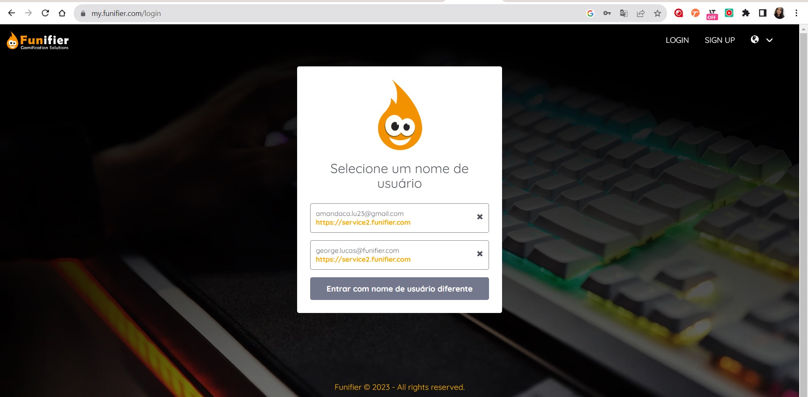

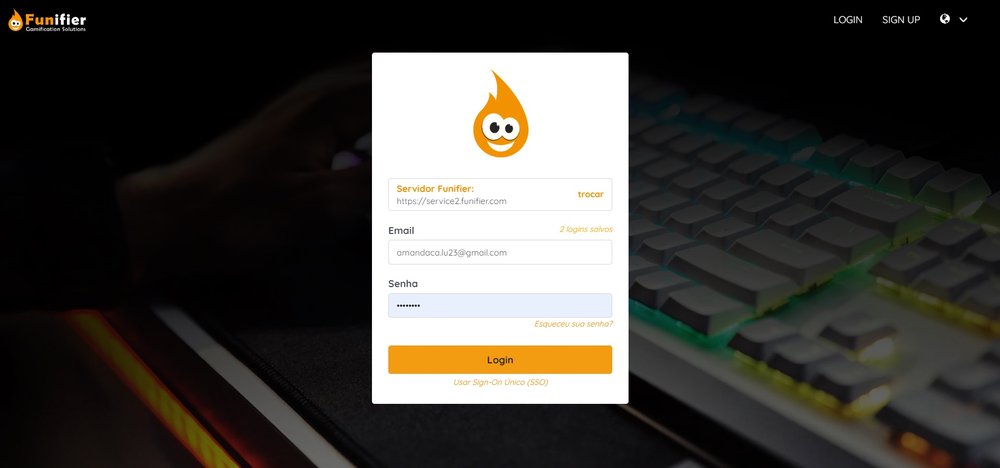

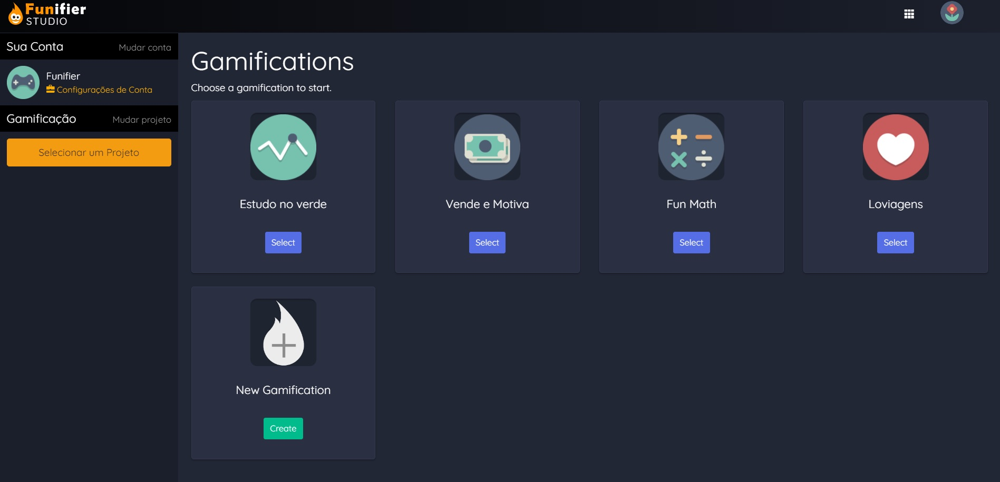

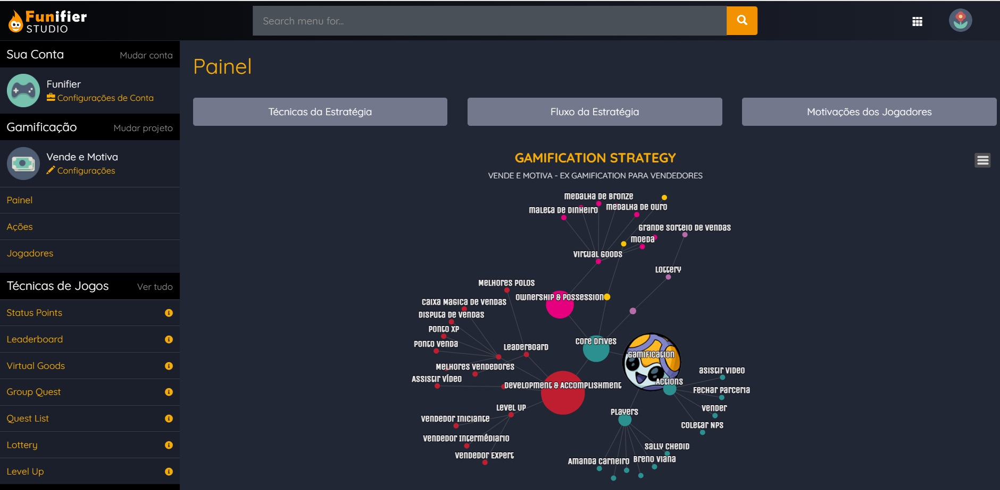

FUNIFIER API: Interface de comunicação com o FUNIFIER SERVER. As interfaces gráficas de uma gamificação usam a API por exemplo para apresentar uma lista de desafios, rankings e outros tipos de feedbacks para os jogadores. O FUNIFIER STUDIO usa a API para permitir aos administradores configurar suas gamificações. Desenvolvedores usam a API para construir integrações que enviam dados para uma gamificação de forma automática. Através desta REST API é possível acionar a execução de qualquer operação disponível no FUNIFIER SERVER, incluindo acessar e manipular os dados da gamificação.

\# API URL: https://service2.funifier.com

FUNIFIER SERVER: Motor central das gamificações, o coração da FUNIFIER, o software onde estão todas as funcionalidades para construção e processamento de todas as gamificações. O SERVER roda em servidores hospedados em nuvens como Digital Ocean, Amazon AWS, Google Cloud e Microsoft Azure. O motor funciona com uma arquitetura de software de multilocação (multi-tenancy) em que uma única instância de FUNIFIER atende vários clientes. Cada cliente tem uma conta, que pode conter uma ou mais gamificações. Com a Funifier, vários clientes compartilham um conjunto comum de recursos de software e hardware, com o mesmo mecanismo de armazenamento de dados. Porém os clientes não compartilham ou veem os dados uns dos outros. Cada gamificação tem seu próprio banco de dados e threads separados.

## 2\. ESTRATÉGIA DE GAMIFICAÇÃO

De forma resumida podemos dizer que para construir uma estratégia de gamificação é necessário definir quais são as ações que você deseja motivar o seu público a executar. Saber quem é este público, que no caso da gamificação chamamos de jogadores. E por fim escolher as técnicas de jogos que serão usadas para motivar esses jogadores a executar as ações desejadas. Veja abaixo as principais funcionalidades para montar sua estratégia de gamificação dentro do FUNIFIER STUDIO:

AÇÕES: Uma ação pode ser vista como um evento ou comportamento que você deseja incentivar no seu público-alvo. São ações que os jogadores realizam no processo que está sendo gamificado. Por exemplo, “vender”, “comprar”, “comentar”, “compartilhar”, “seguir”, “visitar”, “logar”, “reunir”, “ligar”, “estudar”, etc. No contexto de um cenário de vendas, por exemplo, você pode configurar uma ação chamada "vender", que pode ter atributos adicionais como "produto" e "valor" da venda. Uma vez que você definiu quais são as suas ações desejadas, estas poderão ser usadas na estratégia de gamificação, conectadas as várias técnicas de jogos disponíveis na plataforma.

\# Tutorial de Configuração de Ações

https://docs.google.com/document/d/e/2PACX-1vQv1qEVYZxG6kkxumL63ECLivTaH72Hicbdpi5Kj0v51J62rsaJsCNNA-Mq5lxUln0Cog5J0ZwxQg9Q/pub

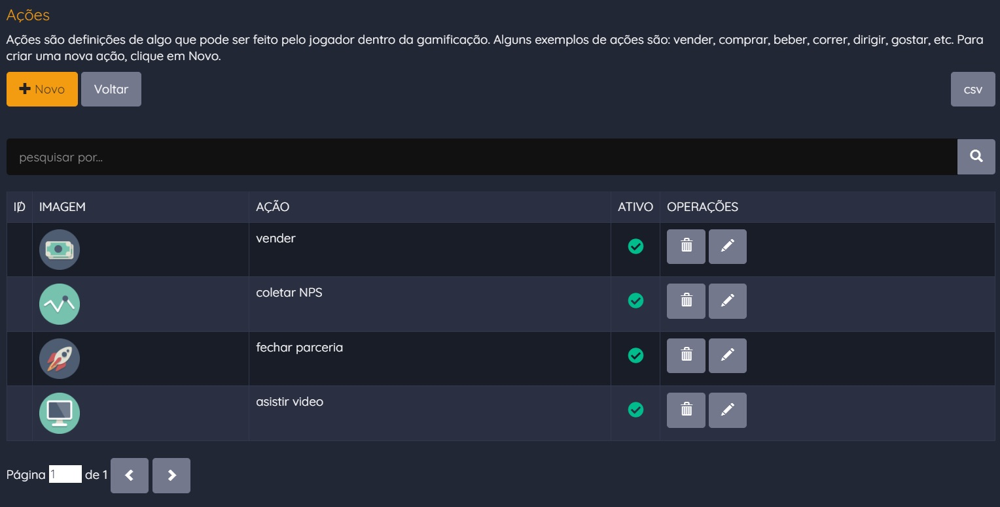

JOGADORES: São as pessoas a serem engajadas com a gamificação. Dentro da plataforma é possível criar o cadastro desses jogadores com quaisquer informações relevantes para estratégia de engajamento como por exemplo nome, e-mail, foto, departamento, sexo, localização geográfica, telefone, e qualquer outro atributo que seja relevante para o jogador dentro do processo de engajamento.

\# Tutorial de Configuração de Jogadores

https://docs.google.com/document/d/e/2PACX-1vRdFmERN-Teu6PEudvfJccQtQpuka9XFQoNlD5TQBt3I8qFU8r-IHYgjwxbKw8IAn9LdOyzm8e2tJHl/pub

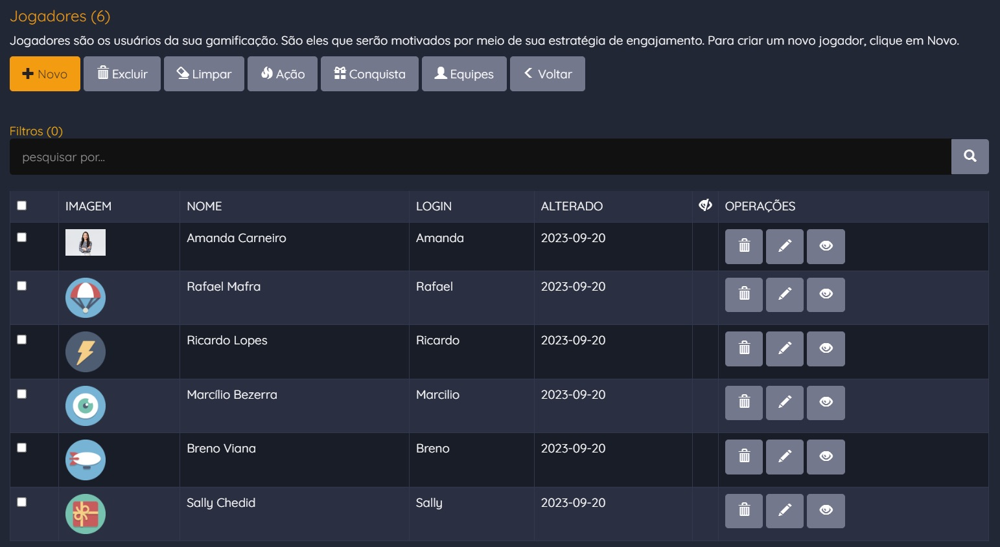

EQUIPES: Os jogadores podem ser agrupados em equipes. Isso permite motivar os jogadores com estímulos sociais. Um jogador pode estar em mais de uma equipe se for necessário, e cada equipe pode ter um dono, que representa a equipe sempre que necessário. As equipes podem, assim como os jogadores, possuir atributos adicionais que possam ser relevantes no processo de engajamento.

\# Tutorial de Configuração de Equipes

[https://docs.google.com/document/d/e/2PACX-1vSU8SrTKFdgf8EILTU8ARjQ8ywYlhKuAJaR_x3T1Yzx-EJCxDdFzPeOqnz2Lnw6EdoT8dCB2EutxRFQ/pub](https://www.google.com/url?q=https://docs.google.com/document/d/e/2PACX-1vSU8SrTKFdgf8EILTU8ARjQ8ywYlhKuAJaR_x3T1Yzx-EJCxDdFzPeOqnz2Lnw6EdoT8dCB2EutxRFQ/pub&sa=D&source=editors&ust=1695693463204465&usg=AOvVaw3VB7xYCtjYz5FtOx7xjezz)

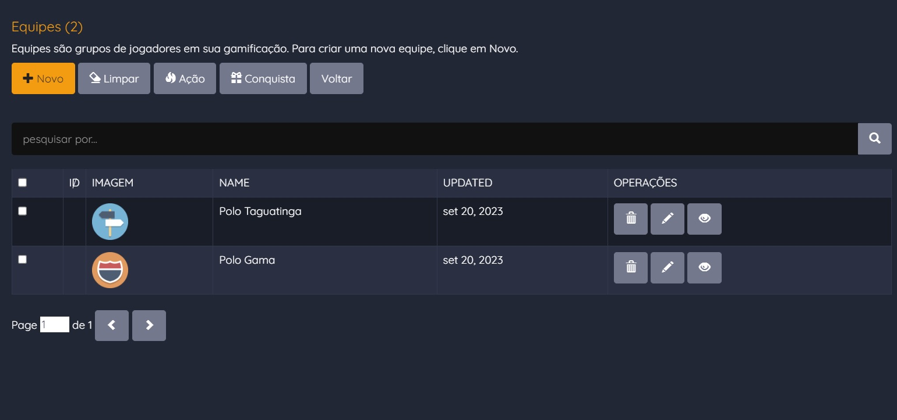

TÉCNICAS DE JOGOS: Este é o principal conjunto de funcionalidades da plataforma, são os elementos que fazem as gamificações serem divertidas e envolventes. As técnicas de jogos motivam os usuários a se comportarem da forma desejada. Existem 90 técnicas que podem ser configuradas na plataforma, como por exemplo: pontos, desafios, níveis, ranking, sorteio, loja virtual, avatar, convidar amigos, competições, desbloqueios, caixa surpresa, convidar amigos, missão em grupo, coleções, booster, feedback instantâneo, barra de progresso, narrativa, etc. Veja abaixo alguns módulos utilizados para configuração das técnicas de jogos:

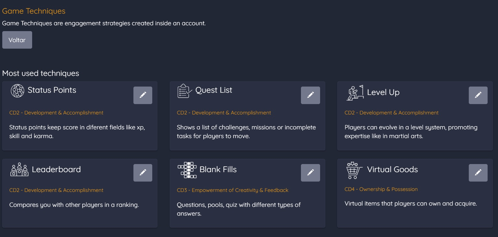

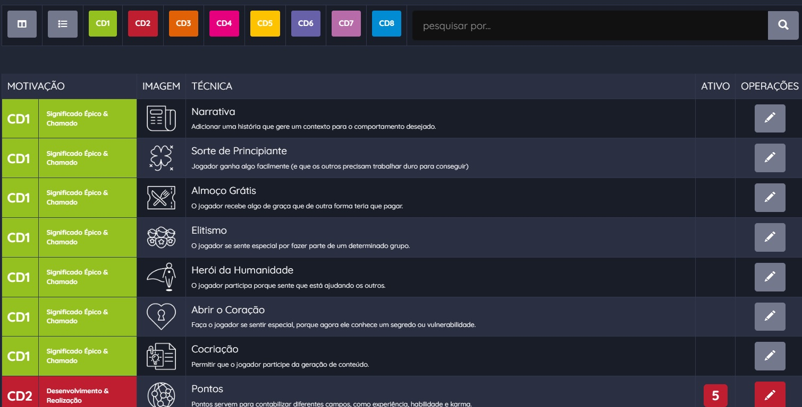

Pontos: São unidades de medida do status do jogador. Você pode ter vários tipos diferentes de pontos em sua gamificação. Pontos de Experiência (XP), Pontos de Reputação, Karma etc. Em uma gamificação para uma escola você poderia ter pontos para cada disciplina, Ex: Pontos de matemática, história, física, química etc. Esses pontos servem para manter a medir o progresso do jogador. Oferece aos jogadores um sistema de feedback para acompanhar seu progresso. O ponto é um ótimo “Mecanismo de Feedback” na estratégia de gamificação. Mostrar às pessoas sua pontuação e como elas mudam com base em pequenas melhorias, muitas vezes as motiva na direção certa. Ao configurar os pontos no Funifier, você declara o nome do ponto, por exemplo, "xp", "karma", "moedas" ou simplesmente "pontos".

\# Tutorial de Configuração de Pontos

https://docs.google.com/document/d/e/2PACX-1vQXPGeS4vKCPT7vTYvXKP-obEmOKySIJfNxcFORmwyxlrr7GBDItnQOtJHd36-ERAV29AcA_6KoBQkc/pub

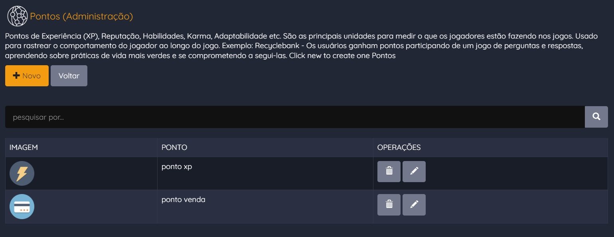

Desafios: São como missões ou tarefas que os jogadores precisam executar. Os desafios são usados para fazer com que os jogadores se mexam. Os desafios incentivam os jogadores a completarem determinadas ações, recompensando-os quando o fazem. Por exemplo, você pode configurar no Funifier o desafio “Vender 10 Livros Caros”, que é concluído quando um jogador executar 10 vezes a ação “vender”, o produto dessas vendas seja “livro” e o valor de cada venda seja maior ou igual a $100. E ao completar este desafio o jogador irá ganhar 25 pontos "xp" e mais 5 "moedas". No desafio configuramos as ações que o jogador precisa executar e as conquistas que isso irá gerar para ele.

\# Tutorial de Configuração de Desafios: https://docs.google.com/document/d/e/2PACX-1vTh90CagSKdkHM8xzbizXdE9Cp8VrVWuta8URUVhUlbtx92wnZHoU_DLk1IPZ-KoS9YtkAfPbeHSm7l/pub

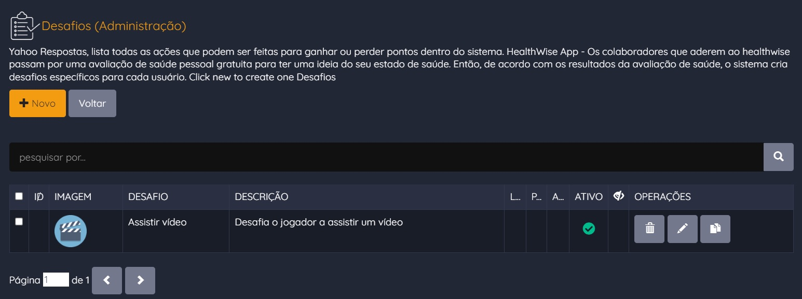

Níveis: Técnica para criar um propósito de evolução para o jogador dentro da gamificação. Por exemplo: Nas artes marciais, as faixas que vão da branca até a preta representa um sistema de níveis; no exército as patentes de soldado a marechal também são níveis; a hierarquia dentro da igreja de padre até papa é outro sistema de níveis; Dentro do Funifier você pode configurar um sistema de nível definindo o nome e quantos pontos é necessário para conquistar cada nível. Por exemplo, Nível Aprendiz (10 xp), Nível Escudeiro (100 xp), Nível Cavaleiro (250 xp), e assim por diante.

\# STUDIO Path: /studio/level

\# API Endpoint: /v3/level

\# JSON Payload: {"level": "Apprentice", "position": 0, "description": "You are learning...",

"minPoints": 10, "requirements": \[{"total": 10, "type": 0, "item": "xp"}\], "point": "xp", "_id": "L0"}

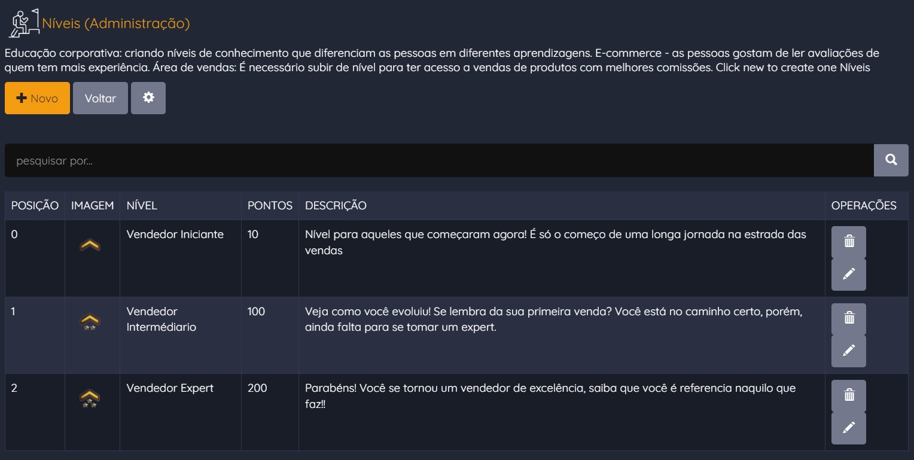

Ranking: Técnica para classificar jogadores com base em seus comportamentos ou resultados. Por exemplo: Um ranking que mostra os 10 jogadores com mais pontos acumulados na semana atual, ordenados de quem tem mais pontos para quem tem menos pontos; Um ranking de operadores de call center com menor tempo médio de atendimento, ordenado menor tempo para o maior; Um ranking das equipes mais ativas na gamificação durante o mês. Para configurar um ranking no Funifier, você informa o título do ranking; se ele é para jogadores ou equipes; a regra de apuração dos líderes; e o período de apuração. Os rankings no Funifier, por padrão, são mantidos em cache, atualizados de tempo em tempo, mas também podem ser configurados para serem gerados em tempo real.

\# STUDIO Path: /studio/leaderboard

\# API Endpoint: /v3/leaderboard

\# JSON Payload: {"title": "Top Players", "description": "Players with the most points in the week", "principalType": 0, "operation": {"type": 3, "achievement\_type": 0, "item": "xp", "sort": -1}, "period": {"type": 0, "timeAmount": 1, "timeScale": 6}, "\_id": "DTjTvZ5"}

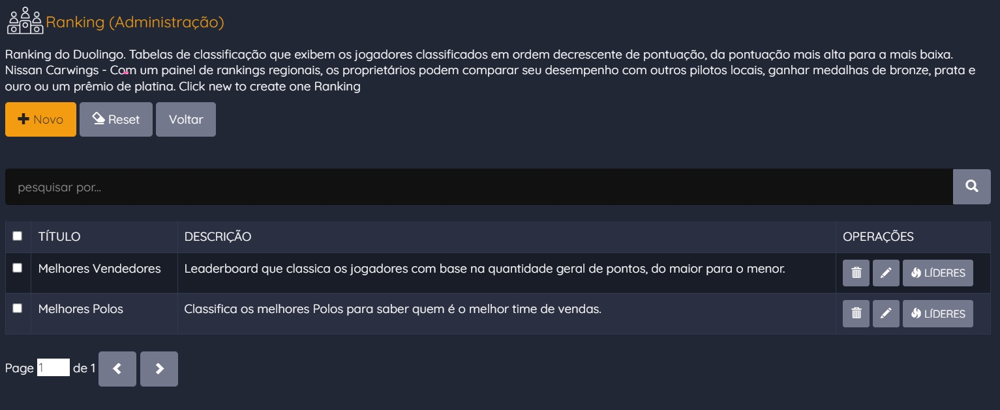

Loja Virtual: Técnica onde jogadores podem adquirir itens dentro de uma gamificação. Por exemplo: Uma loja virtual onde os jogadores podem trocar pontos acumulados na gamificação por souvenirs e gift cards; Uma loja onde os jogadores podem comprar itens virtuais como armas,  armaduras, munições, etc; No Candy Crush você pode comprar doces especiais que podem ser usados no jogo. No Funifier você pode configurar esta técnica criando itens e informando o nome, descrição, quantidade disponível deste item, requisitos para comprar o item e também pode definir um limite de quantos deste item o jogador pode comprar. Por exemplo: uma camiseta, que custa 15 moedas, e pode ser comprada apenas uma vez por mês por cada jogador.

\# STUDIO Path: /studio/virtualgoods/item

\# API Endpoint: /v3/virtualgoods/item

\# JSON Payload: {"catalogId": "gifts", "name": "T-shirt", "description": "White t-shirt with the Funifier logo", "amount": 100, "active": true, "extra": {}, "requires": \[{"total": 15,"type": 0,"item": "coin","operation": 1}\], "rewards": \[\], "notifications": \[\], "i18n": {}, "_id": "DTjVpVA"}

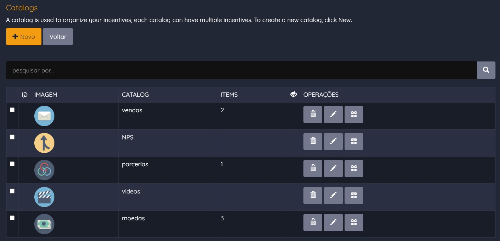

Sorteio: Técnica onde jogadores adquirem cupons para participar do sorteio e quem tiver os números sorteados ganha o prêmio. A cada rodada alguém sempre ganha, e as recompensas são dadas a um número de vencedores selecionado de forma aleatória. Por exemplo: Um sorteio de uma viagem para Cancún, onde temos apenas um ganhador, e o sorteio será realizado em uma data estipulada pelo administrador. Para participar do sorteio você precisa acumular cupons de sorteio, que podem ser conquistados por exemplo realizando algum desafio específico.

\# STUDIO Path: /studio/lottery

\# API Endpoint: /v3/lottery

\# JSON Payload: {"title": "Travel to Cancun", "description": "Travel with a companion to Cancun, with airfare and accommodation, for 7 days.", "drawDate": 1690824650503, "autoExecute": true, "choiceMethod": "random\_ticket", "maxWinners": 1, "maxPerPlayer": 1, "notifications": \[\], "extra": {}, "\_id": "DTj0x5z"}

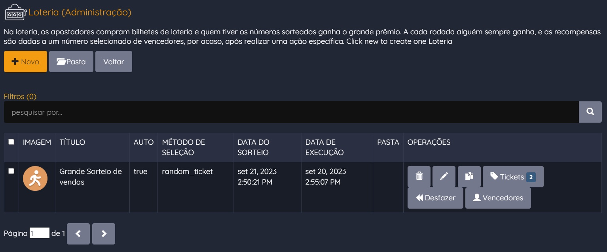

Competição: Técnica que promove a disputa entre dois ou mais jogadores em um determinado período para avaliar quais jogadores alcançam os melhores resultados. Uma competição pode estipular o número máximo de participantes e o número máximo de vencedores. Além disso, o critério de classificação dos competidores deve ser definido assim que a competição é criada. Os jogadores interessados devem se registrar na competição para participar e serem considerados na apuração dos vencedores. Como recompensa, os vencedores de uma competição ganham o título de vencedor da competição com sua respectiva posição na classificação, e também podem ganhar outros prêmios como pontos, itens da loja virtual, cupons para sorteio etc.

\# STUDIO Path: /studio/competition

\# API Endpoint: /v3/competition

\# JSON Payload: {"title": "Sales Race", "description": "Leads the competition who has the highest amount of closed sales in the month.", "period": { "startDate": 1688169600000, "endDate": 1693526399999 }, "maxWinners": 1, "maxPlayers": 100, "minScore": 0, "operation": {"type": 1, "achievement\_type": 0, "item": "sell", "filters": \[\], "sort": -1}, "requires": \[{"total": 10,"type": 0,"item": "coin","operation": 1}\], "rewards": \[{"total": 100, "type": 0, "item": "xp", "operation": 0, "extra": {"position\_start": 1, "position\_ends": 3}}\], "notifications": \[\], "active": true, "autoExecute": true, "extra": {}, "\_id": "race"}

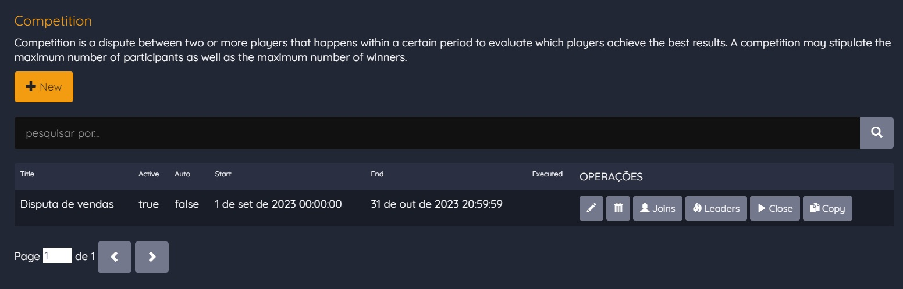

Trocas: Técnica que permite que jogadores troquem com outros jogadores itens conquistados dentro da gamificação. Por exemplo, um jogador pode oferecer aos outros jogadores uma camiseta, em troca de uma bola e mais 10 moedas. Dentro do Funifier o jogador pode ainda aceitar contra propostas de outros jogadores. Neste caso, se mais de um interessado realizar uma contraproposta, o jogador tem opção de escolher a proposta mais vantajosa para ele. Esta técnica pode ser utilizada por exemplo para criar um mercado de troca de figurinhas. Esta é uma técnica que funciona um pouco diferente das outras, pois o administrador não é o responsável por configurar a técnica, mas sim os próprios jogadores.

\# STUDIO Path: /studio/swap

\# API Endpoint: /v3/swap

\# JSON Payload: {"_id": "DTjVp5f", "seller": "john", "extra": {}, "rewards": \[{"total": 1,"type": 2,"item": "DTjVpVA","operation": 0}\], "created": 1688579930448, "requires": \[{"total": 2,"type": 2,"item": "DTj7lVn","operation": 0}\]}

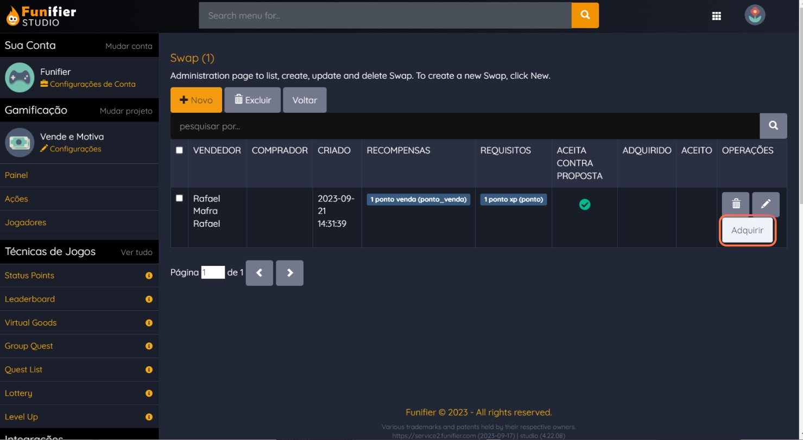

Perguntas: Técnica que permite criar perguntas para os jogadores, para coletar informações ou avaliar conhecimento. Estas perguntas podem ser apresentadas de várias formas, como uma simples enquete ou até mesmo como uma prova inteira repleta de questões. Cada pergunta pode ser apresentada em texto, imagens, conteúdos audiovisuais, e as respostas podem ser de múltipla escolha, verdadeiro ou falso, dissertação, etc. A apresentação desta técnica pode se dar no formato tradicional de perguntas, mas também em formatos de games. O administrador pode definir que uma prova vale 10 pontos, para que o Funifier calcule o percentual de acerto, e a nota final do jogador ao responder aquela prova.

\# STUDIO Path: /studio/question

\# API Endpoint: /v3/question

\# JSON Payload: {"\_id": "64a5b2c", "type": "MULTIPLE\_CHOICE", "title": "Visual Components", "question": "In Funifier, what is the term used for small visual components that can be added to a web page to display specific information?", "grade": 10, "choices": \[{"answer": "1","label": "Points","grade": 0.0}, {"answer": "2","label": "Badges","grade": 0.0}, {"answer": 3","label": "Challenges","grade": 0.0}, {"answer": "4","label": "Leaderboards","grade": 0.0}, {"answer": "5","label": Widgets","grade": 1.0}\], "i18n": {}, "select": "one\_answer", "answerNumbering": "uppercase\_letters", "shuffle": false, "feedbacks": \[\], "extra": {}, "requires": \[\]}

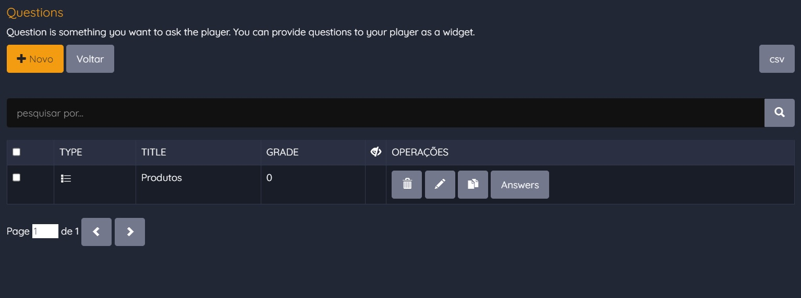

Caixa Surpresa: Técnica onde o jogador recebe prêmios aleatórios. O jogador não sabe o prêmio que irá ganhar. Por exemplo: Uma raspadinha, onde o jogador só descobre se ganhou algum prêmio ou não depois de raspar a cartela; Um jogo de cara ou coroa, onde existe 50% de chance para cada opção; uma roda da fortuna, onde existem várias opções, algumas com prêmios legais e outras nem tanto. Você configura esta técnica no Funifier informando um título para caixa surpresa, as opções possíveis e a probabilidade de cada opção a ser escolhida pela plataforma, e as combinações vencedoras com seus respectivos prêmios.

\# STUDIO Path: /studio/mystery

\# API Endpoint: /v3/mystery

\# JSON Payload: {"title": "Heads or Tails", "options": \[{"title": "Heads","value": "heads","probability": 0.5}, {"title": "Tails", "value": "tails","probability": 0.5}\], "columns": 1, "requirements": \[\], "win\_chart": \[{"combination": \["heads"\],"orderSensitive": false,"reward": {"total": 1,"type": 0,"item": "coin","operation": 0},"isolated": false}\], "extra": {}, "\_id": "64a5b46de"}

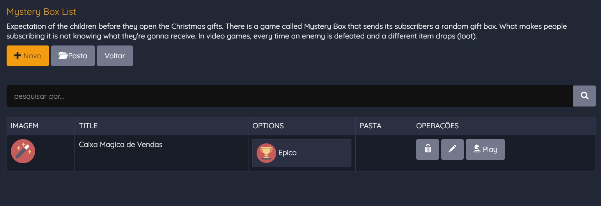

Notificações: Técnica transversal para entrega de feedbacks instantâneos, configurada diretamente em outras técnicas de jogos, para que uma notificação seja gerada quando algo relevante acontecer. Por exemplo, você pode configurar dentro de um desafio para que uma notificação seja entregue ao jogador informando que ele completou aquele desafio. E, ou você pode também configurar uma notificação em uma competição para notificar os ganhadores assim que a apuração final for realizada ver ponto, você também pode configurar uma notificação para ser entregue ao jogador quando ele fizer uma compra em uma loja virtual. As notificações podem ser apresentadas como um texto simples em um pop-up, ou de forma mais rica como um personagem apresentando diversas expressões diferentes dependendo do humor da mensagem entregue ao jogador.

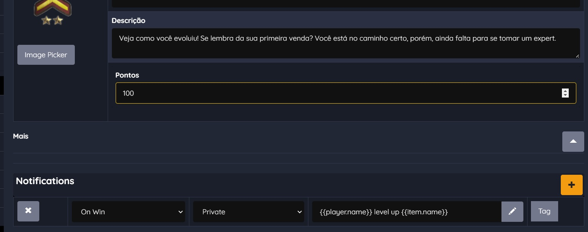

ESTRATÉGIA: A primeira página apresentada ao acessar uma gamificação dentro do FUNIFIER STUDIO é o dashboard onde os administradores podem visualizar a estratégia de gamificação por inteiro. Quais elementos compõem a estratégia, e como as ações, jogadores, motivações humanas e técnicas de jogos se conectam. Isso permite identificar eventuais pontos de melhoria na estratégia. Esta estratégia é representada visualmente em gráficos que explicam rapidamente como está funcionando a estratégia de engajamento como um todo.

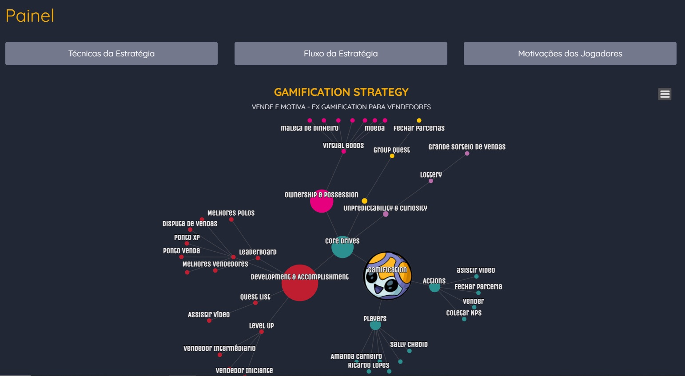

CONQUISTAS: No universo do Funifier, as conquistas são marcos significativos que os jogadores alcançam ao interagir com o sistema de gamificação. Elas são uma forma tangível de representar o progresso e o sucesso do jogador. As conquistas podem assumir várias formas, dependendo da estrutura da gamificação. Elas podem ser a realização de um desafio específico, a acumulação de uma certa quantidade de pontos, a progressão para um novo nível, a obtenção de uma medalha ou insígnia, a aquisição de um item virtual, ou até mesmo a vitória em um sorteio ou competição. Por exemplo, em um cenário de vendas, um desafio chamado "Super Vendedor" pode ser criado. Este desafio é considerado alcançado quando um vendedor realiza uma venda. A ação de realizar uma venda é enviada ao Funifier como um "action log". O Funifier, então, analisa este "action log" e identifica as conquistas que foram geradas por causa desta ação do jogador. Neste caso, a conquista poderia ser a realização do desafio "Super Vendedor", que poderia resultar em várias outras conquistas para o vendedor, como a conquista de 10 pontos, a progressão para um novo nível, ou a conquista de uma insígnia especial.

\# STUDIO Path: /studio/achievement

\# API Endpoint: /v3/achievement

\# JSON Payload: {"_id": "64a5cd2", "player": "john", "total": 10.0, "type": 0, "item": "xp", "time": 1688587166582}

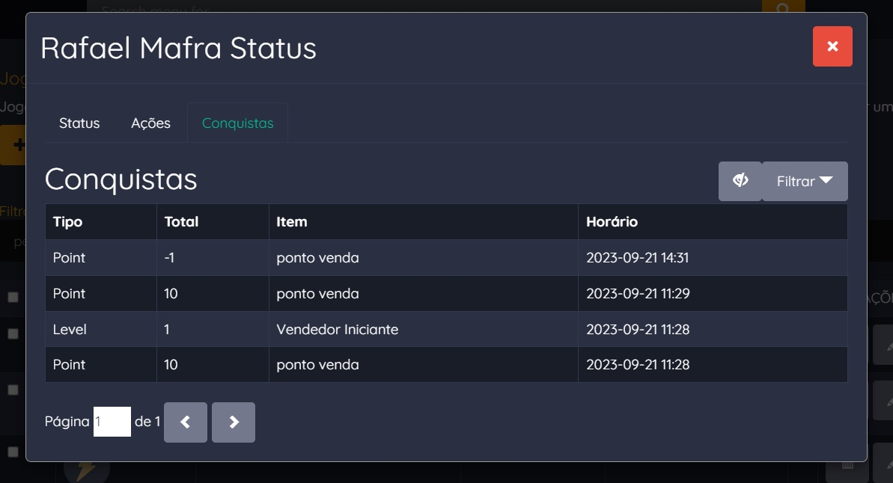

## 3\. AJUSTES FINOS DA GAMIFICAÇÃO

Algumas vezes as gamificações apresentam regras muito específicas que exigem da plataforma FUNIFIER a flexibilidade em permitir ao cliente escrever seus próprios códigos para alteração dos comportamentos padrão da plataforma para atender suas próprias necessidades. Veja abaixo algumas das funcionalidades existentes para estender a plataforma:

TRIGGERS: Triggers são códigos JAVA executados dentro do FUNIFIER ENGINE quando um evento específico acontecer dentro da gamificação. As triggers oferecem aos desenvolvedores uma grande flexibilidade para manipular informações em tempo real, permitindo mudar o comportamento padrão das técnicas de jogos e demais funcionalidades da plataforma. Por exemplo, a funcionalidade padrão de cadastro de um jogador na gamificação, não faz nada além de cadastrar os dados do jogador no banco de dados. Porém, com a Trigger, o desenvolvedor pode escrever um código JAVA para enviar um email de boas vindas para o jogador, logo após ele ser cadastrado no banco de dados.

\# Tutorial de Configuração de Triggers

https://docs.google.com/document/d/e/2PACX-1vSNhtSjYXZ4VAdvH6bg3QQCIlQo3dVYAZ8-FwuaTQoGAIdM3m-Cl9fIe1oYA0BnLQNLCJm5FRSXyNAP/pub

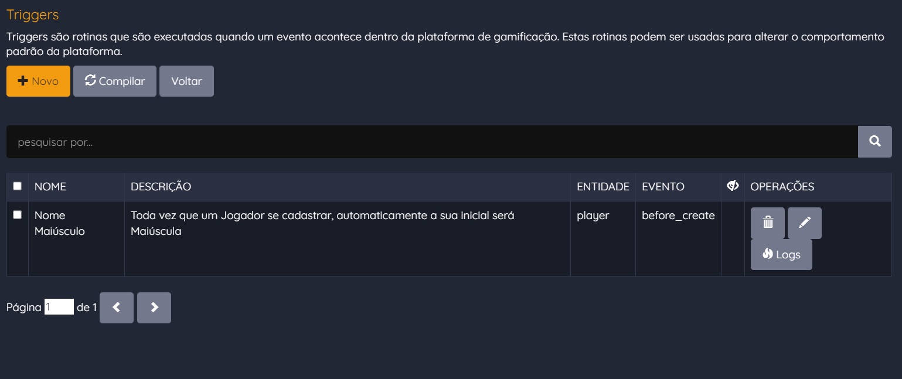

SCHEDULERS: Esta é uma funcionalidade avançada que permite ao administrador configurar tarefas para serem executadas em um horário específico e repetidas em uma frequência definida. Por exemplo, o administrador pode criar um Scheduler para gerar relatórios de engajamento semanalmente e enviar para os gerentes da empresa. Os Schedulers no Funifier utilizam a linguagem Java, permitindo aos desenvolvedores uma grande flexibilidade para definir a lógica exata da tarefa, incluindo a integração com o banco de dados do Funifier, envio de emails, fazer requisições HTTP, ler arquivos de um diretório FTP e assim por diante. Desta forma, é possível automatizar muitas tarefas que normalmente precisam ser realizadas manualmente, liberando tempo para se concentrar em outras áreas importantes.

\# STUDIO Path: /studio/scheduler

\# API Endpoint: /v3/scheduler

\# JSON Payload: 
```
{"name": "Sent Report With Total Players Every Monday at Noon", "cron": "0 0 12 ? * MON", "script": "void execute(scheduler){ \\n  long total = manager.getPlayerManager().findTotal();\\n\\t\\t\\n  org.simplejavamail.email.Email email = org.simplejavamail.email.EmailBuilder\\n  .startingBlank()\\n  .from(\\"Support\\", \\"support@funifier.com\\")\\n  .to(\\"Ricardo\\", \\"ricardo@funifier.com\\")\\n  .withSubject(\\"Total players so far!\\")\\n  .withPlainText(\\"So far we have \\" + total + \\" players\\")\\n  .buildEmail();\\n\\n  org.simplejavamail.mailer.MailerBuilder.withSMTPServer(\\"server\\", 587, \\"user\\", \\"password\\").buildMailer().sendMail(email);\\n}", "active": false, "timezone": "America/New\_York", "extra": {}, "\_id": "64a5e42"}
```

\# JAVA Code:
```
void execute(scheduler){

  long total = manager.getPlayerManager().findTotal();

  org.simplejavamail.email.Email email = org.simplejavamail.email.EmailBuilder

  .startingBlank()

  .from("Support", "support@funifier.com")

  .to("Ricardo", "ricardo@funifier.com")

  .withSubject("Total players so far!")

  .withPlainText("So far we have " + total + " players")

  .buildEmail();

  org.simplejavamail.mailer.MailerBuilder.withSMTPServer("server", 587, "user", "password").buildMailer().sendMail(email);

}
```

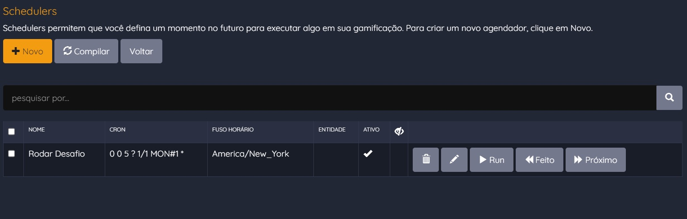

CUSTOM OBJECTS: Os objetos customizados existem para atender as necessidades específicas de cada negócio que está sendo gamificado. Eles podem ser qualquer informação que o administrador da gamificação considerar relevante para a gamificação, mas que não faça parte da relação de objetos padrão da plataforma. Por exemplo, saber os produtos que uma empresa vende pode ser importante para uma gamificação de uma equipe de vendas; saber quais são os feriados do país pode ser importante para criar feedbacks personalizados para os jogadores em datas comemorativas, ou qualquer outra informação que precise ser apresentada na gamificação ou que possa ser necessário para apoiar uma técnica de jogo.

\# API Endpoint: /v3/database/{collection}

\# JSON Payload: {"field1": "content1", "field2": "content1", "_id": "64a5e"}

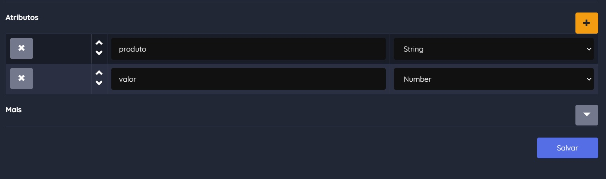

CUSTOM PAGES: Esta funcionalidade permite criar dentro do FUNIFIER STUDIO páginas para atender necessidades específicas dos administradores de uma gamificação. Por exemplo: Em uma gamificação de uma equipe de vendas de veículos, o gestor pode ter a necessidade de gerenciar os veículos que a equipe vende. Neste caso poderíamos criar uma página de administração de veículos; Este gestor pode ainda ter a necessidade de acompanhar os resultados da equipe, neste caso poderíamos criar uma página com indicadores de performance da equipe, mostrando o total de vendas, gráficos em pizza mostrando o percentual de vendas por veículo, a quantidade de vendas por vendedor, etc.

\# Tutorial de Configuração de Custom Pages

https://docs.google.com/document/d/e/2PACX-1vS6hySEq7sccw9PVMNiD7sHgymAbGBUnOyYMIov2zSrHh6j-Al3TEr8uNf97MpuzRiVM78SuANEfX74/pub

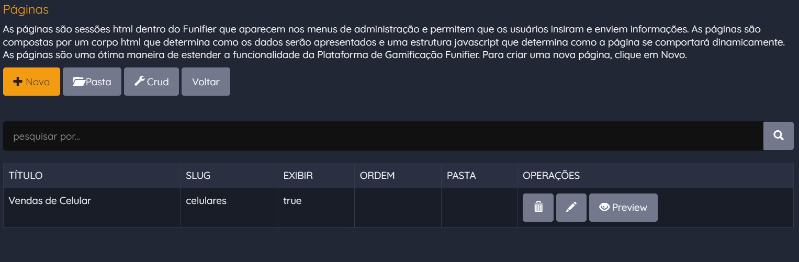

## 4\. INTERFACES GRÁFICAS E FEEDBACKS

Os jogadores podem interagir com a gamificação nos mais diversos locais. A interação pode se dar em um app mobile, uma página na internet, um totem em um shopping, no EAD de uma escola, no CRM usado pela equipe de vendas, nas redes sociais, etc. Estas interfaces são extremamente importantes no processo de engajamento. São nelas que os usuários receberão os feedbacks da gamificação. São nestas interfaces que eles conhecerão os desafios que têm para cumprir e receberão as notificações dando os parabéns quando ganharem alguma recompensa. As interfaces podem ser criadas na linguagem de preferência do cliente e na maioria das vezes utilizar a API para enviar e receber os dados necessários. Veja abaixo algumas funcionalidades utilizadas na construção destas interfaces:

WIDGETS: São componentes visuais para dar algum tipo de feedback para os jogadores. Os widgets representam visualmente as várias técnicas de jogos. Por exemplo, caso a técnica de ranking seja configurada na estratégia de gamificação é importante mostrar este ranking para os jogadores em algum lugar. Estes componentes gráficos podem ser inseridos em sistemas web pré-existentes como uma intranet, ou um sistema usado pela empresa como um CRM, ou LMS. Além disso, constantemente os widgets são customizados para incorporar a identidade visual das empresas que estão utilizando a plataforma Funifier.

\# STUDIO Path: /studio/widget

\# API Endpoint: /v3/widget

\# JSON Payload: {"title": "Hello World", "html": "&lt;h1&gt;Hello World!&lt;/h1&gt;", "_id": "hello"}

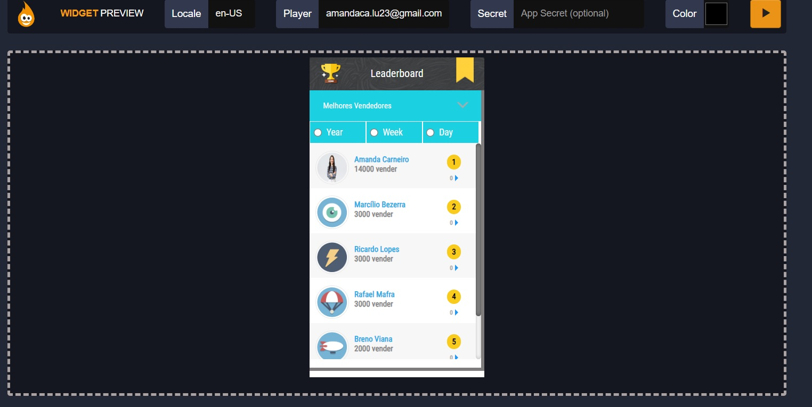

AGGREGATES: São comandos a serem executados no banco de dados da gamificação a fim de consultar e transformar os dados para serem apresentados na interface gráfica. Com estes comandos é possível retornar para o jogador as informações no formato exato que o desenvolvedor deseja apresentar. Estes comandos também são fundamentais na análise de dados e resultados de uma gamificação, constantemente sendo utilizados na construção de relatórios. O mongo é o banco de dados utilizado pela plataforma de gamificação, e a sintaxe destes comandos é a mesma utilizada por este banco.

\# Tutorial de Aggregates

https://docs.google.com/document/d/e/2PACX-1vS2hXTSknqL6-zxOLGgtBwhiCscPBxuuTCPVEU0YFbDxxCb4rZKndaRbZ6E-qZQ0CpLpjnQkQn7YLre/pub

\# API Endpoint: /v3/database/{collection}/aggregate

\# JSON Payload: \[{"$match":{ "player": "john", "item": "xp" }}, {"$group":{ "_id":null, "total":{"$sum":"$total"} }}\]

FINDS: São comandos aggregate encapsulados do lado do servidor. Algumas vezes os comandos podem ficar muito grandes, ou simplesmente o desenvolvedor por questões de segurança não quer expor os comandos que estão sendo executados no banco de dados para retornar uma determinada informação para o jogador. Neste caso o Funifier permite a construção destes comandos no lado do servidor, e assim a chamada na interface gráfica do usuário fica simplificada ocultando do jogador o entendimento de como isso acontece nos bastidores.

\# STUDIO Path: /studio/prepared

\# API Endpoint: /v3/prepared/aggregate

\# JSON Payload: {"\_id": "total\_xp", "title": "Total XP", "description": "Total xp points the player has", "collection": "achievement", "aggregate": "\[\\n    {\\"$match\\":{ \\"player\\": \\"$param:player\\", \\"item\\": \\"xp\\" }},\\n    {\\"$group\\":{ \\"_id\\":null, \\"total\\":{\\"$sum\\":\\"$total\\"} }}\\n\]",

"script": "void prepare(aggregations, params) {}"}

\# MONGO Aggregate: \[{"$match":{ "player": "$param:player", "item": "xp" }}, {"$group":{ "_id":null, "total":{"$sum":"$total"} }}\]

WEBSOCKETS: Permitem a entrega de feedbacks em tempo real para os jogadores em uma interface web. Este recurso ajuda a criar experiências muito mais envolventes. Uma das coisas que pode ser feito utilizando esse recurso é oferecer a possibilidade de um jogador conversar com o outro em tempo real, sem a necessidade de executar múltiplas requisições a API.

\# STUDIO Path: /studio/websocket

MULTILÍNGUE: Suporte a vários idiomas nos mais variados níveis. Incluindo inglês e português, mas não se restringindo a estes idiomas. As interfaces gráficas dos jogadores (widgets) suportam vários idiomas. Técnicas de jogos como por exemplo desafios, virtual goods e outras também podem ser configuradas e servidas em diversos idiomas. A interface de administração também suporta múltiplos idiomas. A documentação da plataforma também está disponível em vários idiomas.

STATICS: Com este recurso é possível criar subdomínios dentro da plataforma Funifier. Dentro deste subdomínio o cliente pode publicar conteúdos estáticos, como por exemplo uma interface completa de gamificação para os jogadores. Este repositório de conteúdos estáticos pode sincronizar arquivos de um repositório Git, de um arquivo zip, ou informar manualmente que arquivos você deseja enviar para este repositório exposto em um subdomínio Funifier.

\# STUDIO Path: /studio/static

## 5\. SEGURANÇA

Um processo gamificado também requer um certo nível de segurança, alguns clientes por exemplo são obrigados a atender a leis de proteção de dados como por exemplo a LGPD no Brasil ou a GDPR na Europa. Por isso a FUNIFIER oferece uma série de recursos para proteção dos dados, facilitando o processo de compliance dos clientes a estas normas de segurança internacionais.

CONTROLE DE ACESSO: Na plataforma é possível controlar o acesso que cada jogador ou aplicativo tem dentro de uma gamificação. É possível criar perfis (roles) especificando o escopo de acesso que aquele perfil possui dentro da gamificação. Um jogador pode ter mais de um perfil de acesso. Além disso, a plataforma também possui controle de acesso para gestores que usam a interface administrativa da gamificação, podendo definir por exemplo quais usuários têm acesso a uma determinada conta e quais funcionalidades ele pode gerenciar dentro da gamificação.

\# STUDIO Path: /studio/security

AUTENTICAÇÃO: A plataforma suporta alguns tipos de autenticação como por exemplo basic e oauth. Além disso, é possível especificar o tempo de expiração para tokens do tipo Bearer. É possível ainda criar módulos de autenticação customizados dentro de cada gamificação, dando condições da empresa estipular o seu próprio modelo de autenticação caso seja necessário, por exemplo forçando os jogadores a se autenticar através do ldap. Além disso, os jogadores podem se logar fazendo uso de múltiplos logins, por exemplo um mesmo jogador podendo-se logar com o seu usuário do Twitter ou o seu usuário do Facebook.

\# STUDIO Path: /studio/security

AUTH MODULE: É um recurso utilizado para escrever uma rotina customizada de autenticação dos jogadores em uma gamificação. Por padrão, quando o jogador se autentica em uma gamificação, a plataforma verifica se aquele login e senha informados são válidos. Porém, pode ser necessário algum tipo de validação ou inclusão de rotinas adicionais no momento da autenticação. Por exemplo, podemos utilizar este recurso para verificar se o login de usuário é válido em um sistema fora do Funifier. Outro exemplo é registrar um action log de login, no momento em que o jogador se autenticar. Outro exemplo é criar uma senha mestra para que um administrador possa acessar a interface do jogador em nome de qualquer jogador, sem precisar saber a senha daquele jogador específico. Outro exemplo é para apoiar a implementação de um SSO.

\# STUDIO Path: /studio/auth

CRIPTOGRAFIA: Impede que usuários não autorizados vejam campos de texto personalizados que devem ser mantidos privados por questões de segurança ou para atender algum tipo de norma de segurança como a GDPR, LGPD (Lei Geral de Proteção de Dados Brasileira) e etc. Os campos criptografados são definidos com chaves mestre de 128 bits e usam o algoritmo AES (Advanced Encryption Standard, padrão de criptografia avançado). O administrador pode arquivar, excluir e importar a chave mestre de criptografia.

\# STUDIO Path: /studio/crypt

AUDITORIA: Os administradores podem utilizar este recurso para estipular quais informações devem ser auditadas dentro da plataforma. Com isso é possível por exemplo identificar quem alterou o cadastro de um jogador, quando e quais informações foram alteradas. Desta forma é possível proteger o sistema de ações criminosas ou de erros humanos que porventura venham a por exemplo excluir sem querer um dado da gamificação.

\# STUDIO Path: /studio/audit

## 6\. INTEGRAÇÃO DE DADOS

As integrações permitem que a plataforma de gamificação se comunique e interaja com outras plataformas e serviços.A maioria das gamificações requer algum tipo de integração com sistemas externos. Quanto mais automático e frequente for o processo de alimentar a gamificação com os dados que serão usados para dar feedback aos jogadores, melhor costuma ser o engajamento dos mesmos por consequência o resultado esperado com a gamificação. Veja abaixo alguns dos recursos mais utilizados para alimentar a gamificação:

ACTION LOGS: Quando um jogador executa uma ação, isso é registrado dentro do Funifier como um log de ação. Por exemplo, quando um jogador faz uma venda de um livro por R$10, isso é um log de ação. A diferença entre ação e log de ação é a seguinte: a ação é apenas a definição do que pode ser feito; enquanto o log de ação é a execução daquela ação por um jogador. Para rodar uma gamificação você precisa enviar para o Funifier os logs de ações executadas pelos jogadores. Todas as técnicas de jogos dependem direta ou indiretamente dos logs de ações para serem acionadas.

Quando um log de ação é executado, a plataforma analisa se alguma técnica de jogo da gamificação foi acionada por causa do log de ação, e se isso gerou alguma conquista para o jogador. Por exemplo, suponha que temos na estratégia, um desafio que dá 10 pontos ao jogador que vender um livro. Quando a plataforma recebe um log de ação, informando que um jogador fez a venda de um livro. A plataforma irá ver que existe um desafio que é concluído com a ação de vender um livro. Isso irá fazer com que a plataforma registre a conquista daquele desafio pelo jogador informado no log de ação. E por que o desafio foi concluído, a plataforma irá registrar a conquista dos 10 pontos. Então neste caso a conquista do desafio depende diretamente do log de ação. Enquanto que a conquista dos 10 pontos depende indiretamente do log de ação.

Geralmente são construídas integrações para enviar estes logs de ações ao Funifier usando a API. Por exemplo, podemos construir uma integração que, quando um funcionário registra uma venda dentro do CRM, um software pegue esta informação do banco do CRM e envie esta informação para o FUNIFIER fazendo uma chamada na API.

\# STUDIO Path: /studio/action/log

\# API Endpoint: /v3/action/log

\# JSON Payload: {"actionId": "sell", "userId": "john", "attributes": {"product": "book", "price": 62}}

ZAPIER: As integrações podem ser feitas por pessoas das áreas de negócios dos clientes utilizando o Zapier. Com isso é possível automatizar a integração de mais de 5000 apps de mercado com as gamificações feitas na plataforma FUNIFIER sem a necessidade de escrever códigos de programação para isso. Podendo integrar as gamificações com por exemplo redes sociais como facebook, twitter, instagram, softwares de CRM, LMS, Help Desk, E-commerce, Marketing e outros.

Com o Zapier você pode por exemplo: Ler os tweets publicados no Twitter e registrar os logs de ações destes tweets no Funifier; Sempre que um usuário se inscrever na sua página do Facebook criar este usuário como jogador no Funifier; Quando um jogador ganhar pontos registrar esta conquista em uma planilha do google drive; Quando um vendedor concluir uma venda nos SalesForce, registrar um log de ação desta venda no Funifier.

\# STUDIO Path: /studio/integration/zapier

STAGING: Em projetos reais é comum a criação de ambientes de homologação e de produção. O recurso de staging é utilizado para a gestão desses ambientes, permitindo clonar e migrar dados de um ambiente para outro. Possibilitando a criação de ambientes espelho. Sendo possível, por exemplo, criar um ambiente de produção em uma instância rodando nos Estados Unidos e um ambiente espelho de homologação rodando em uma instância na Europa. Este é um recurso muito importante para projetos de missão crítica operarem com segurança, enquanto são feitos os desenvolvimentos e testes a serem incluídas na gamificação.

\# STUDIO Path: /studio/integration/staging

SDK: Possui Kits de Desenvolvimento de Software (SDK) em diversas linguagens como JAVA, Javascript e outros para acelerar o processo de desenvolvimento e integração com sistemas.

## 7\. ANALYTICS E PERFORMANCE

De forma geral, a gamificação tem como objetivo engajar um público a se comportar de uma determinada maneira para produzir algum tipo de resultado. Veja abaixo algumas das funcionalidades disponíveis para analisar os resultados de uma gamificação e garantir uma boa performance:

RELATÓRIOS: Dashboards com gráficos, listas e filtros para análise de dados, podem ser construídos utilizando a funcionalidade de páginas customizadas dentro do FUNIFIER STUDIO em conjunto com os comandos aggregate. Cada cliente costuma construir o seu próprio dashboard, com os KPIs mais relevantes para o seu negócio. Com isso é possível acompanhar se o projeto está produzindo os resultados, bem como ter insights importantes.

MOTIVAÇÕES GERADAS: O Funifier possui um recurso poderoso chamado "Dashboard de Motivações Geradas". Este painel analisa as interações com interfaces gráficas e ações realizadas pelos jogadores, identificando as técnicas de jogo com as quais eles mais gostam de interagir. Cada técnica de jogo está vinculada a um "core drive" (motivação humana), permitindo que a plataforma descubra quais "core drive" mais influenciam cada jogador. Por exemplo, se um jogador interage frequentemente com elementos como pontos, desafios e níveis, a plataforma pode inferir que o core drive "Desenvolvimento e Realização" é uma motivação forte para esse jogador. Estas informações são então apresentadas no Dashboard de Motivações Geradas, fornecendo insights valiosos que podem ser usados para personalizar e melhorar a experiência do jogador, aumentando assim o engajamento.

INDEX: Esta é uma funcionalidade avançada que permite ao administrador, através da api, consultar os índices ativos em uma coleção do banco de dados bem como criar novos índices para melhorar a performance de pesquisas no banco de dados da gamificação.

\# API Endpoint: /v3/database/{collection}/index

\# JSON Payload: {"field_name": 1}

## 8\. MELHORAR A GAMIFICAÇÃO

Compreender a gamificação e implementar estratégias eficazes é apenas o começo. Refinar suas gamificação para obter os melhores resultados, envolve capacitar as equipes de negócios e de tecnologia para garantir um conhecimento profundo da plataforma Funifier e do processo de gamificação. Esta seção explica que recursos podem ser usados para aperfeiçoar continuamente suas estratégias e obter o máximo de engajamento:

WORKSHOPS: Existem workshops de capacitação profissional tanto de pessoas das áreas de negócio como para equipes de tecnologia do cliente. Os workshops são mãos na massa, intercalando conteúdo com exercícios práticos. O workshop de gamification designer foi modelado para o cliente que deseja aprender como planejar suas próprias gamificações. E o workshop de gamification developer foi modelado para clientes que querem implementar gamificações com sua própria equipe de tecnologia. As capacitações podem ser feitas no modelo presencial ou online.

CERTIFICAÇÃO: Programa de certificação profissional para avaliar aqueles profissionais que irão atuar no dia a dia da construção e manutenção dos programas de engajamento construídos usando a plataforma Funifier. Organizações que trabalham com profissionais certificados pela Funifier têm maiores chances de sucesso nas implementações de estratégias de gamificação.

DOCUMENTAÇÃO: Diversos conteúdos nos idiomas inglês, português e francês, cobrindo os diversos assuntos relacionados com a plataforma são disponibilizados para os diferentes perfis que vão usar o FUNIFIER. A documentação apresenta desde tutoriais passo a passo de como utilizar os vários recursos da plataforma, bem como exemplos, trechos de códigos e outras informações de consultas pontuais necessárias para empoderar o usuário da plataforma para operar a solução de forma autônoma.

## 9\. COMPARTILHAR NO MARKETPLACE

O Marketplace é um espaço onde os usuários podem encontrar, compartilhar e reutilizar componentes de gamificação prontos. Este recurso é especialmente útil para evitar a repetição de trabalho e acelerar o processo de construção da gamificação.

MARKETPLACE: Local onde podemos encontrar componentes prontos para inserir na gamificação, sem precisar construir ou configurar do zero. Permite aos usuários do FUNIFIER empacotar componentes de uma gamificação, como por exemplo um conjunto de desafios, rankings, widgets, etc, e disponibilizar estes pacotes para serem utilizados por outros usuários da plataforma de gamificação, evitando o retrabalho e acelerando o processo de construção da gamificação. Por exemplo: Uma grande empresa pode montar um modelo de gamificação para ser replicado em várias unidades da empresa por seus gestores, onde cada um destes gestores pode ter sua própria gamificação, porém construída a partir de um modelo disponibilizado pela administração central, no marketplace de gamificações. Este é um espaço onde desenvolvedores e parceiros Funifier podem inclusive vender suas gamificações personalizadas para outros clientes Funifier. O Marketplace permite que você publique pacotes de gamificação, que podem ser gratuitos ou pagos. Isso significa que você pode monetizar suas soluções de gamificação, criando uma nova fonte de receita. Ao publicar no Marketplace, você está não apenas monetizando seu trabalho, mas também contribuindo para a comunidade Funifier, permitindo que outros se beneficiem de suas inovações e experiências em gamificação.

\# STUDIO Path: /market

10\. OUTROS TÓPICOS

Introdução a este tópico…

Licenças: A plataforma FUNIFIER pode ser contratada no modelo SaaS. Em instância dedicada ou compartilhada. O cliente pode escolher a nuvem (Digital Ocean, Amazon AWS, Google Cloud ou Microsoft Azure) e a região onde sua instância estará hospedada (América do Sul, América do Norte, Europa ou Ásia). Todas as instâncias dedicadas ou compartilhadas são mantidas pela equipe da FUNIFIER. A cobrança é feita por número de jogadores ativos de cada gamificação que esteja em produção.

Folder: Permite a criação de pastas virtuais dentro do Funifier onde você pode incluir conteúdos, que podem ser qualquer coisa configurada dentro do Funifier como por exemplo uma técnica de jogo, ou objeto customizado. Esta funcionalidade pode ser utilizada, entre outras coisas, para construir um curso online, composto de módulos, onde cada aluno possui um conjunto de aulas, e cada aula possui um conjunto de conteúdos. Uma das capacidades dessa funcionalidade é monitorar o progresso do jogador dentro dessa árvore de diretórios e conteúdos. É possível, por exemplo, saber que um jogador já completou 50% de um curso. E ao progredir podemos registrar logs de ações, que acionam as técnicas de jogos. E assim podemos, por exemplo, criar desafios que são concluídos quando o jogador completar um curso.

\# STUDIO Path: /studio/folder

Custom KPIs: Ao configurar um desafio você deve definir que ações o jogador deve executar para completar aquele desafio. Isto é feito em um configurador de regras dentro do desafio onde é possível informar qual ação deve ser executada quantas vezes, com que frequência, etc. Porém, algumas vezes essa regra pode ser extremamente complexa, envolvendo fórmulas que não podem ser configuradas com os parâmetros padrão. Neste caso, usamos o recurso de custom kpis. Onde o programador pode escrever os comandos de banco que devem ser executados para avaliar se aquele comportamento do jogador aconteceu. Perceba que este recurso deve ser usado com moderação apenas nos casos onde o construtor de regras padrão do Funifier não for suficiente para exprimir a regra necessária para aquele negócio. As custam kpis podem ser utilizadas em diversas técnicas, como nos desafios, rankings, competições, e algumas outras.
