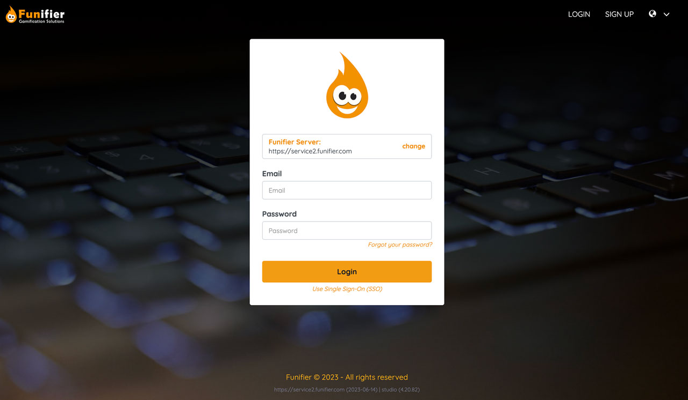

# Create your account

Aqui está um guia simples de como criar uma conta na Funifier. Apenas siga os passos abaixo:

## Passo 1: Acesse a página de registro

Abra o seu navegador web de preferência e acesse o endereço [https://my.funifier.com/register](https://my.funifier.com/register).

## Passo 2: Preencha o formulário de cadastro

Preencha o formulário de cadastro com as suas informações. Depois de preencher todas as informações necessárias, clique no botão para enviar o formulário.

## Passo 3: Confirme o seu endereço de e-mail

Após o cadastro, você receberá um e-mail de confirmação. Abra esse e-mail e clique no link de confirmação para verificar o seu endereço de e-mail. Isso é necessário para garantir a segurança da sua conta.

## Passo 4: Comece a usar a Funifier

Uma vez que você confirmou seu endereço de e-mail, sua conta está pronta para ser usada! Você agora pode acessar a plataforma Funifier e começar a criar suas campanhas de gamificação.

Se você tiver qualquer problema durante o processo de registro, entre em contato com o suporte ao cliente da Funifier para assistência.

