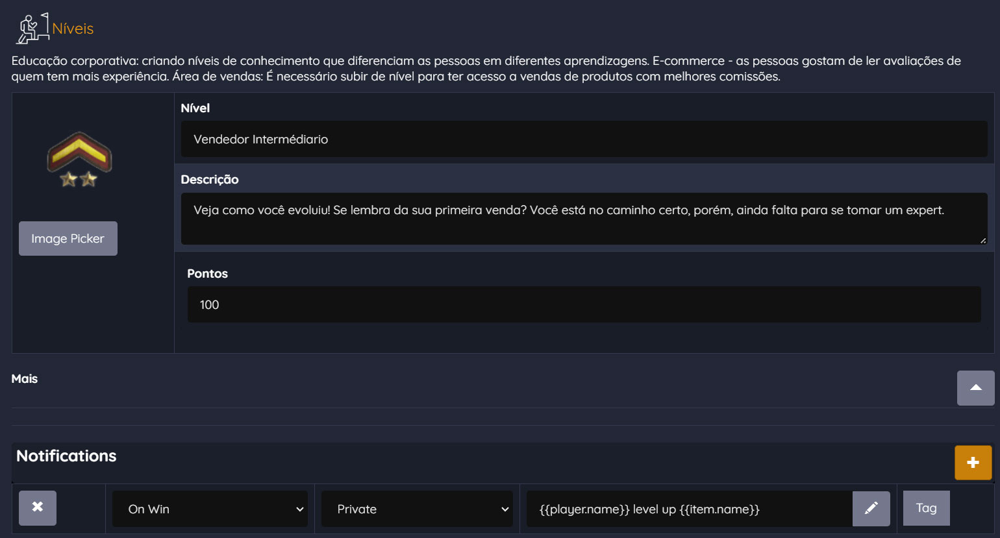

# Notificações

Notificações

Essa técnica transversal, quando configurada diretamente em outras mecânicas de jogo, desempenha um papel crucial ao proporcionar aos jogadores uma experiência mais imersiva e dinâmica. Ela faz a entrega de feedbacks instantâneos, configurada diretamente em outras técnicas de jogos, para que uma notificação seja gerada quando algo relevante acontecer. Por exemplo, você pode configurar dentro de um desafio para que uma notificação seja entregue ao jogador informando que ele completou aquele desafio. E, ou você pode também configurar uma notificação em uma competição para notificar os ganhadores assim que a apuração final for realizada ver ponto, você também pode configurar uma notificação para ser entregue ao jogador quando ele fizer uma compra em uma loja virtual. As notificações podem ser apresentadas como um texto simples em um pop-up, ou de forma mais rica como um personagem apresentando diversas expressões diferentes dependendo do humor da mensagem entregue ao jogador.

\*\*Funifier Studio:\*\*

Você pode adicionar notificações em cada uma das técnicas de jogos que adicionar em sua gamificação, faça isso na aba de configuração das técnicas, quando estiver personalizando sua gamificação da maneira que precisar, note que sempre terá uma aba “Notifications” ou “Notificações”, para você adicionar esse feedback visual a sua técnica de engajamento. Por exemplo, aqui está a tela de configuração de um nível, aqui definimos uma Notificação para que mostre “Level up” para o jogador quando ele conseguir avançar a este nível.

Imagine que você está criando um jogo de aventura com desafios e conquistas. Uma maneira eficaz de manter os jogadores envolvidos é configurar notificações instantâneas que são acionadas quando algo relevante acontece. Por exemplo, ao completar um desafio, o jogador recebe uma notificação que o parabeniza pela conquista. Essa notificação pode ser apresentada em forma de pop-up, exibindo um texto simples ou até mesmo um personagem animado com expressões que refletem o sucesso do jogador.

\*\*Celebrando Conquistas em Competições:\*\*

Em competições dentro de jogos, seja uma corrida de carros, um jogo de estratégia ou uma competição esportiva virtual, as notificações instantâneas podem adicionar uma camada adicional de emoção e reconhecimento. Quando a apuração final é realizada e os vencedores são determinados, as notificações podem ser enviadas aos vencedores para celebrar sua vitória. Essa comunicação imediata de resultados e reconhecimento pode aumentar a satisfação dos jogadores e incentivá-los a continuar participando em futuras competições.

\*\*Estimulando a Participação em Compras:\*\*

Em um cenário de gamificação aplicado a uma loja virtual, as notificações instantâneas podem ser usadas para incentivar a participação do jogador e aumentar as conversões. Por exemplo, quando um jogador realiza uma compra, uma notificação pode ser entregue para parabenizá-lo pela aquisição e até mesmo oferecer recompensas virtuais adicionais, como pontos de fidelidade ou moedas virtuais. Essas recompensas imediatas podem criar uma experiência de compra mais gratificante.

\*\*Personalização das Mensagens:\*\*

Uma característica interessante das notificações instantâneas na gamificação é a capacidade de personalização. As mensagens podem ser adaptadas de acordo com o desempenho e as preferências do jogador. Por exemplo, um jogador que alcança um novo recorde pode receber uma notificação de reconhecimento pelo feito. Ao mesmo tempo, um jogador que está enfrentando desafios pode receber mensagens de incentivo para mantê-lo motivado.

\*\*Desafios Técnicos:\*\*

Implementar notificações instantâneas requer considerações técnicas, como integração com serviços de mensagens ou sistemas de notificação push. Garantir que as notificações sejam entregues de forma confiável e oportuna é essencial para manter a experiência do jogador positiva.

Em resumo, as notificações instantâneas são uma técnica poderosa na gamificação para envolver, motivar e reconhecer os jogadores. Elas podem ser configuradas em várias partes do gameplay, desde desafios e competições até interações em lojas virtuais. Ao oferecer feedbacks em tempo real e reconhecimento, as notificações instantâneas contribuem significativamente para a experiência do jogador, tornando-a mais imersiva e gratificante. Portanto, ao projetar sistemas gamificados, não subestime o impacto positivo que notificações bem planejadas podem ter na motivação e no engajamento dos jogadores.
